```mermaid
flowchart TB
    subgraph current["ContosoUniversity.csproj"]
        MAIN["<b>⚙️&nbsp;ContosoUniversity.csproj</b><br/><small>net48</small>"]
        click MAIN "#contosouniversitycsproj"
    end

```

# Projects and dependencies analysis

This document provides a comprehensive overview of the projects and their dependencies in the context of upgrading to .NETCoreApp,Version=v10.0.

## Table of Contents

- [Executive Summary](#executive-Summary)
  - [Highlevel Metrics](#highlevel-metrics)
  - [Projects Compatibility](#projects-compatibility)
  - [Package Compatibility](#package-compatibility)
  - [API Compatibility](#api-compatibility)
- [Aggregate NuGet packages details](#aggregate-nuget-packages-details)
- [Top API Migration Challenges](#top-api-migration-challenges)
  - [Technologies and Features](#technologies-and-features)
  - [Most Frequent API Issues](#most-frequent-api-issues)
- [Projects Relationship Graph](#projects-relationship-graph)
- [Project Details](#project-details)

  - [ContosoUniversity.csproj](#contosouniversitycsproj)

## Executive Summary

### Highlevel Metrics

| Metric | Count | Status |
| :--- | :---: | :--- |
| Total Projects | 1 | All require upgrade |
| Total NuGet Packages | 45 | 26 need upgrade |
| Total Code Files | 66 |  |
| Total Code Files with Incidents | 27 |  |
| Total Lines of Code | 4406 |  |
| Total Number of Issues | 621 |  |
| Estimated LOC to modify | 565+ | at least 12,8% of codebase |

### Projects Compatibility

| Project | Target Framework | Difficulty | Package Issues | API Issues | Est. LOC Impact | Description |
| :--- | :---: | :---: | :---: | :---: | :---: | :--- |
| [ContosoUniversity.csproj](#contosouniversitycsproj) | net48 | 🔴 High | 39 | 565 | 565+ | Wap, Sdk Style = False |

### Package Compatibility

| Status | Count | Percentage |
| :--- | :---: | :---: |
| ✅ Compatible | 19 | 42,2% |
| ⚠️ Incompatible | 2 | 4,4% |
| 🔄 Upgrade Recommended | 24 | 53,3% |
| ***Total NuGet Packages*** | ***45*** | ***100%*** |

### API Compatibility

| Category | Count | Impact |
| :--- | :---: | :--- |
| 🔴 Binary Incompatible | 521 | High - Require code changes |
| 🟡 Source Incompatible | 44 | Medium - Needs re-compilation and potential conflicting API error fixing |
| 🔵 Behavioral change | 0 | Low - Behavioral changes that may require testing at runtime |
| ✅ Compatible | 2467 |  |
| ***Total APIs Analyzed*** | ***3032*** |  |

## Aggregate NuGet packages details

| Package | Current Version | Suggested Version | Projects | Description |
| :--- | :---: | :---: | :--- | :--- |
| Antlr | 3.4.1.9004 |  | [ContosoUniversity.csproj](#contosouniversitycsproj) | Needs to be replaced with Replace with new package Antlr4=4.6.6 |
| bootstrap | 5.3.3 |  | [ContosoUniversity.csproj](#contosouniversitycsproj) | ✅Compatible |
| jQuery | 3.7.1 |  | [ContosoUniversity.csproj](#contosouniversitycsproj) | ✅Compatible |
| jQuery.Validation | 1.21.0 |  | [ContosoUniversity.csproj](#contosouniversitycsproj) | ✅Compatible |
| Microsoft.AspNet.Mvc | 5.2.9 |  | [ContosoUniversity.csproj](#contosouniversitycsproj) | NuGet package functionality is included with framework reference |
| Microsoft.AspNet.Razor | 3.2.9 |  | [ContosoUniversity.csproj](#contosouniversitycsproj) | NuGet package functionality is included with framework reference |
| Microsoft.AspNet.Web.Optimization | 1.1.3 |  | [ContosoUniversity.csproj](#contosouniversitycsproj) | ⚠️NuGet package is incompatible |
| Microsoft.AspNet.WebPages | 3.2.9 |  | [ContosoUniversity.csproj](#contosouniversitycsproj) | NuGet package functionality is included with framework reference |
| Microsoft.Bcl.AsyncInterfaces | 1.1.1 | 10.0.1 | [ContosoUniversity.csproj](#contosouniversitycsproj) | NuGet package upgrade is recommended |
| Microsoft.Bcl.HashCode | 1.1.1 | 6.0.0 | [ContosoUniversity.csproj](#contosouniversitycsproj) | NuGet package upgrade is recommended |
| Microsoft.CodeDom.Providers.DotNetCompilerPlatform | 2.0.1 |  | [ContosoUniversity.csproj](#contosouniversitycsproj) | NuGet package functionality is included with framework reference |
| Microsoft.Data.SqlClient | 2.1.4 | 6.1.3 | [ContosoUniversity.csproj](#contosouniversitycsproj) | NuGet package contains security vulnerability |
| Microsoft.Data.SqlClient.SNI.runtime | 2.1.1 |  | [ContosoUniversity.csproj](#contosouniversitycsproj) | ✅Compatible |
| Microsoft.EntityFrameworkCore | 3.1.32 | 10.0.1 | [ContosoUniversity.csproj](#contosouniversitycsproj) | NuGet package upgrade is recommended |
| Microsoft.EntityFrameworkCore.Abstractions | 3.1.32 | 10.0.1 | [ContosoUniversity.csproj](#contosouniversitycsproj) | NuGet package upgrade is recommended |
| Microsoft.EntityFrameworkCore.Analyzers | 3.1.32 | 10.0.1 | [ContosoUniversity.csproj](#contosouniversitycsproj) | NuGet package upgrade is recommended |
| Microsoft.EntityFrameworkCore.Relational | 3.1.32 | 10.0.1 | [ContosoUniversity.csproj](#contosouniversitycsproj) | NuGet package upgrade is recommended |
| Microsoft.EntityFrameworkCore.SqlServer | 3.1.32 | 10.0.1 | [ContosoUniversity.csproj](#contosouniversitycsproj) | NuGet package upgrade is recommended |
| Microsoft.EntityFrameworkCore.Tools | 3.1.32 | 10.0.1 | [ContosoUniversity.csproj](#contosouniversitycsproj) | NuGet package upgrade is recommended |
| Microsoft.Extensions.Caching.Abstractions | 3.1.32 | 10.0.1 | [ContosoUniversity.csproj](#contosouniversitycsproj) | NuGet package upgrade is recommended |
| Microsoft.Extensions.Caching.Memory | 3.1.32 | 10.0.1 | [ContosoUniversity.csproj](#contosouniversitycsproj) | NuGet package upgrade is recommended |
| Microsoft.Extensions.Configuration | 3.1.32 | 10.0.1 | [ContosoUniversity.csproj](#contosouniversitycsproj) | NuGet package upgrade is recommended |
| Microsoft.Extensions.Configuration.Abstractions | 3.1.32 | 10.0.1 | [ContosoUniversity.csproj](#contosouniversitycsproj) | NuGet package upgrade is recommended |
| Microsoft.Extensions.Configuration.Binder | 3.1.32 | 10.0.1 | [ContosoUniversity.csproj](#contosouniversitycsproj) | NuGet package upgrade is recommended |
| Microsoft.Extensions.DependencyInjection | 3.1.32 | 10.0.1 | [ContosoUniversity.csproj](#contosouniversitycsproj) | NuGet package upgrade is recommended |
| Microsoft.Extensions.DependencyInjection.Abstractions | 3.1.32 | 10.0.1 | [ContosoUniversity.csproj](#contosouniversitycsproj) | NuGet package upgrade is recommended |
| Microsoft.Extensions.Logging | 3.1.32 | 10.0.1 | [ContosoUniversity.csproj](#contosouniversitycsproj) | NuGet package upgrade is recommended |
| Microsoft.Extensions.Logging.Abstractions | 3.1.32 | 10.0.1 | [ContosoUniversity.csproj](#contosouniversitycsproj) | NuGet package upgrade is recommended |
| Microsoft.Extensions.Options | 3.1.32 | 10.0.1 | [ContosoUniversity.csproj](#contosouniversitycsproj) | NuGet package upgrade is recommended |
| Microsoft.Extensions.Primitives | 3.1.32 | 10.0.1 | [ContosoUniversity.csproj](#contosouniversitycsproj) | NuGet package upgrade is recommended |
| Microsoft.Identity.Client | 4.21.1 |  | [ContosoUniversity.csproj](#contosouniversitycsproj) | ⚠️NuGet package is deprecated |
| Microsoft.jQuery.Unobtrusive.Validation | 4.0.0 |  | [ContosoUniversity.csproj](#contosouniversitycsproj) | ✅Compatible |
| Microsoft.Web.Infrastructure | 2.0.1 |  | [ContosoUniversity.csproj](#contosouniversitycsproj) | NuGet package functionality is included with framework reference |
| Modernizr | 2.6.2 |  | [ContosoUniversity.csproj](#contosouniversitycsproj) | ✅Compatible |
| NETStandard.Library | 2.0.3 |  | [ContosoUniversity.csproj](#contosouniversitycsproj) | NuGet package functionality is included with framework reference |
| Newtonsoft.Json | 13.0.3 | 13.0.4 | [ContosoUniversity.csproj](#contosouniversitycsproj) | NuGet package upgrade is recommended |
| System.Buffers | 4.5.1 |  | [ContosoUniversity.csproj](#contosouniversitycsproj) | NuGet package functionality is included with framework reference |
| System.Collections.Immutable | 1.7.1 | 10.0.1 | [ContosoUniversity.csproj](#contosouniversitycsproj) | NuGet package upgrade is recommended |
| System.ComponentModel.Annotations | 4.7.0 |  | [ContosoUniversity.csproj](#contosouniversitycsproj) | NuGet package functionality is included with framework reference |
| System.Diagnostics.DiagnosticSource | 4.7.1 | 10.0.1 | [ContosoUniversity.csproj](#contosouniversitycsproj) | NuGet package upgrade is recommended |
| System.Memory | 4.5.4 |  | [ContosoUniversity.csproj](#contosouniversitycsproj) | NuGet package functionality is included with framework reference |
| System.Numerics.Vectors | 4.5.0 |  | [ContosoUniversity.csproj](#contosouniversitycsproj) | NuGet package functionality is included with framework reference |
| System.Runtime.CompilerServices.Unsafe | 4.5.3 | 6.1.2 | [ContosoUniversity.csproj](#contosouniversitycsproj) | NuGet package upgrade is recommended |
| System.Threading.Tasks.Extensions | 4.5.4 |  | [ContosoUniversity.csproj](#contosouniversitycsproj) | NuGet package functionality is included with framework reference |
| WebGrease | 1.5.2 |  | [ContosoUniversity.csproj](#contosouniversitycsproj) | ✅Compatible |

## Top API Migration Challenges

### Technologies and Features

| Technology | Issues | Percentage | Migration Path |
| :--- | :---: | :---: | :--- |
| ASP.NET Framework (System.Web) | 541 | 95,8% | Legacy ASP.NET Framework APIs for web applications (System.Web.*) that don't exist in ASP.NET Core due to architectural differences. ASP.NET Core represents a complete redesign of the web framework. Migrate to ASP.NET Core equivalents or consider System.Web.Adapters package for compatibility. |
| Legacy Configuration System | 16 | 2,8% | Legacy XML-based configuration system (app.config/web.config) that has been replaced by a more flexible configuration model in .NET Core. The old system was rigid and XML-based. Migrate to Microsoft.Extensions.Configuration with JSON/environment variables; use System.Configuration.ConfigurationManager NuGet package as interim bridge if needed. |

### Most Frequent API Issues

| API | Count | Percentage | Category |
| :--- | :---: | :---: | :--- |
| T:System.Web.Mvc.ViewResult | 45 | 8,0% | Binary Incompatible |
| T:System.Web.Mvc.ActionResult | 43 | 7,6% | Binary Incompatible |
| P:System.Web.Mvc.ControllerBase.ViewBag | 41 | 7,3% | Binary Incompatible |
| M:System.Web.Mvc.Controller.View(System.Object) | 34 | 6,0% | Binary Incompatible |
| T:System.Web.Mvc.ModelStateDictionary | 26 | 4,6% | Binary Incompatible |
| P:System.Web.Mvc.Controller.ModelState | 26 | 4,6% | Binary Incompatible |
| M:System.Web.Mvc.ModelStateDictionary.AddModelError(System.String,System.String) | 19 | 3,4% | Binary Incompatible |
| M:System.Web.Mvc.HttpPostAttribute.#ctor | 17 | 3,0% | Binary Incompatible |
| T:System.Web.Mvc.HttpPostAttribute | 17 | 3,0% | Binary Incompatible |
| T:System.Web.Mvc.SelectList | 14 | 2,5% | Binary Incompatible |
| T:System.Web.Mvc.RedirectToRouteResult | 13 | 2,3% | Binary Incompatible |
| M:System.Web.Mvc.Controller.RedirectToAction(System.String) | 13 | 2,3% | Binary Incompatible |
| T:System.Web.Mvc.HttpStatusCodeResult | 13 | 2,3% | Binary Incompatible |
| M:System.Web.Mvc.HttpStatusCodeResult.#ctor(System.Net.HttpStatusCode) | 13 | 2,3% | Binary Incompatible |
| M:System.Web.Mvc.ValidateAntiForgeryTokenAttribute.#ctor | 12 | 2,1% | Binary Incompatible |
| T:System.Web.Mvc.ValidateAntiForgeryTokenAttribute | 12 | 2,1% | Binary Incompatible |
| T:System.Web.Mvc.HttpNotFoundResult | 12 | 2,1% | Binary Incompatible |
| M:System.Web.Mvc.Controller.HttpNotFound | 12 | 2,1% | Binary Incompatible |
| M:System.Web.Mvc.SelectList.#ctor(System.Collections.IEnumerable,System.String,System.String,System.Object) | 12 | 2,1% | Binary Incompatible |
| M:System.TimeSpan.FromSeconds(System.Double) | 7 | 1,2% | Source Incompatible |
| M:System.Web.Mvc.BindAttribute.#ctor | 7 | 1,2% | Binary Incompatible |
| T:System.Web.Mvc.BindAttribute | 7 | 1,2% | Binary Incompatible |
| P:System.Web.Mvc.ModelStateDictionary.IsValid | 7 | 1,2% | Binary Incompatible |
| M:System.Web.Mvc.Controller.View | 7 | 1,2% | Binary Incompatible |
| T:System.Web.Mvc.JsonResult | 6 | 1,1% | Binary Incompatible |
| T:System.Web.Optimization.Bundle | 5 | 0,9% | Binary Incompatible |
| M:System.Web.Optimization.BundleCollection.Add(System.Web.Optimization.Bundle) | 5 | 0,9% | Binary Incompatible |
| T:System.Configuration.ConfigurationManager | 4 | 0,7% | Source Incompatible |
| M:System.Web.Mvc.ActionNameAttribute.#ctor(System.String) | 4 | 0,7% | Binary Incompatible |
| T:System.Web.Mvc.ActionNameAttribute | 4 | 0,7% | Binary Incompatible |
| T:System.Web.HttpServerUtilityBase | 4 | 0,7% | Source Incompatible |
| P:System.Web.Mvc.Controller.Server | 4 | 0,7% | Binary Incompatible |
| M:System.Web.HttpServerUtilityBase.MapPath(System.String) | 4 | 0,7% | Source Incompatible |
| P:System.Web.HttpPostedFileBase.ContentLength | 4 | 0,7% | Source Incompatible |
| M:System.Web.Mvc.Controller.View(System.String) | 4 | 0,7% | Binary Incompatible |
| M:System.Web.Mvc.Controller.#ctor | 4 | 0,7% | Binary Incompatible |
| T:System.Web.Mvc.JsonRequestBehavior | 4 | 0,7% | Binary Incompatible |
| T:System.Web.Optimization.ScriptBundle | 4 | 0,7% | Binary Incompatible |
| M:System.Web.Optimization.ScriptBundle.#ctor(System.String) | 4 | 0,7% | Binary Incompatible |
| M:System.Web.Optimization.Bundle.Include(System.String,System.Web.Optimization.IItemTransform[]) | 3 | 0,5% | Binary Incompatible |
| T:System.Web.Mvc.UrlParameter | 3 | 0,5% | Binary Incompatible |
| P:System.Configuration.ConfigurationManager.AppSettings | 2 | 0,4% | Source Incompatible |
| T:System.Web.HttpPostedFileBase | 2 | 0,4% | Source Incompatible |
| M:System.Web.HttpPostedFileBase.SaveAs(System.String) | 2 | 0,4% | Source Incompatible |
| P:System.Web.HttpPostedFileBase.FileName | 2 | 0,4% | Source Incompatible |
| M:System.Web.Mvc.SelectList.#ctor(System.Collections.IEnumerable,System.String,System.String) | 2 | 0,4% | Binary Incompatible |
| M:System.Web.Mvc.Controller.Dispose(System.Boolean) | 2 | 0,4% | Binary Incompatible |
| T:System.Web.Mvc.Controller | 2 | 0,4% | Binary Incompatible |
| M:System.Web.Mvc.Controller.Json(System.Object) | 2 | 0,4% | Binary Incompatible |
| F:System.Web.Mvc.JsonRequestBehavior.AllowGet | 2 | 0,4% | Binary Incompatible |

## Projects Relationship Graph

Legend:
📦 SDK-style project
⚙️ Classic project

## Project Details

### ContosoUniversity.csproj

#### Project Info

- **Current Target Framework:** net48
- **Proposed Target Framework:** net10.0
- **SDK-style**: False
- **Project Kind:** Wap
- **Dependencies**: 0
- **Dependants**: 0
- **Number of Files**: 94
- **Number of Files with Incidents**: 27
- **Lines of Code**: 4406
- **Estimated LOC to modify**: 565+ (at least 12,8% of the project)

#### Dependency Graph

Legend:
📦 SDK-style project
⚙️ Classic project

### API Compatibility

| Category | Count | Impact |
| :--- | :---: | :--- |
| 🔴 Binary Incompatible | 521 | High - Require code changes |
| 🟡 Source Incompatible | 44 | Medium - Needs re-compilation and potential conflicting API error fixing |
| 🔵 Behavioral change | 0 | Low - Behavioral changes that may require testing at runtime |
| ✅ Compatible | 2467 |  |
| ***Total APIs Analyzed*** | ***3032*** |  |

#### Project Technologies and Features

| Technology | Issues | Percentage | Migration Path |
| :--- | :---: | :---: | :--- |
| Legacy Configuration System | 16 | 2,8% | Legacy XML-based configuration system (app.config/web.config) that has been replaced by a more flexible configuration model in .NET Core. The old system was rigid and XML-based. Migrate to Microsoft.Extensions.Configuration with JSON/environment variables; use System.Configuration.ConfigurationManager NuGet package as interim bridge if needed. |
| ASP.NET Framework (System.Web) | 541 | 95,8% | Legacy ASP.NET Framework APIs for web applications (System.Web.*) that don't exist in ASP.NET Core due to architectural differences. ASP.NET Core represents a complete redesign of the web framework. Migrate to ASP.NET Core equivalents or consider System.Web.Adapters package for compatibility. |

