# Component Catalog — ContosoUniversity

_Extracted on 2026-05-13. One section per significant component. All paths are relative to `src/ContosoUniversity/`._

## Module Dependency Diagram

```mermaid
graph TD
    subgraph Bootstrap
        Global[Global.asax.cs<br/>MvcApplication]
        AppStart[App_Start/RouteConfig<br/>FilterConfig<br/>BundleConfig]
    end

    subgraph Controllers
        Base[Controllers/BaseController]
        Home[Controllers/HomeController]
        Stu[Controllers/StudentsController]
        Ins[Controllers/InstructorsController]
        Crs[Controllers/CoursesController]
        Dep[Controllers/DepartmentsController]
        Notif[Controllers/NotificationsController]
        MQT[Controllers/MessageQueueTestController]
    end

    subgraph Services
        NS[Services/NotificationService]
        LS[Services/LoggingService<br/>EMPTY FILE]
    end

    subgraph Infra[Infrastructure]
        IMQ[IMessageQueue]
        MQM[MessageQueueManager]
        IMQimpl[InMemoryMessageQueue]
        MQ[MessageQueue]
        Msg[Message + IMessageFormatter +<br/>XmlMessageFormatter +<br/>DefaultMessageFormatter]
        MQX[MessageQueueExceptions]
    end

    subgraph DataLayer[Data]
        Ctx[SchoolContext]
        Fact[SchoolContextFactory]
        Init[DbInitializer]
    end

    subgraph Models
        Person[Person + Student + Instructor]
        Course[Course]
        Dept[Department]
        Enr[Enrollment]
        Off[OfficeAssignment]
        CA[CourseAssignment]
        Notification[Notification + EntityOperation]
        Err[ErrorViewModel]
        VMs[SchoolViewModels.*]
    end

    Util[PaginatedList&lt;T&gt;]
    Ex[Examples/MessageQueueExample]

    Global --> AppStart
    Global --> Fact
    Global --> Init
    Global --> Ctx

    Home --> Base
    Stu --> Base
    Ins --> Base
    Crs --> Base
    Dep --> Base
    Notif --> Base
    MQT --> NS
    MQT --> MQ
    MQT --> MQM

    Base --> Fact
    Base --> NS
    Base --> Notification

    Stu --> Ctx
    Stu --> Person
    Stu --> Util
    Ins --> Ctx
    Ins --> Person
    Ins --> CA
    Ins --> VMs
    Crs --> Ctx
    Crs --> Course
    Dep --> Ctx
    Dep --> Dept
    Home --> Ctx
    Home --> VMs
    Notif --> NS
    Notif --> Notification

    NS --> MQ
    NS --> Msg
    NS --> Notification

    MQ --> MQM
    MQ --> Msg
    MQ --> MQX
    MQM --> IMQimpl
    IMQimpl --> IMQ
    IMQimpl --> Msg

    Ctx --> Person
    Ctx --> Course
    Ctx --> Dept
    Ctx --> Enr
    Ctx --> Off
    Ctx --> CA
    Ctx --> Notification

    Fact --> Ctx
    Init --> Ctx

    Ex --> MQ
    Ex --> NS
```

---

## Component: `Global.asax.cs` — `MvcApplication`

- **Path:** [src/ContosoUniversity/Global.asax.cs](src/ContosoUniversity/Global.asax.cs)
- **Type:** Application bootstrap (ASP.NET `HttpApplication`)
- **Responsibilities:**
  - In `Application_Start`: register MVC areas, global filters, routes, and bundles, then call `InitializeDatabase()`.
  - In `InitializeDatabase()`: read the `DefaultConnection` connection string from `Web.config`, build a `DbContextOptionsBuilder<SchoolContext>` configured for SQL Server, construct a `SchoolContext`, and pass it to `DbInitializer.Initialize(context)`.
- **Dependencies (imports):** `System.Web`, `System.Web.Mvc`, `System.Web.Optimization`, `System.Web.Routing`, `Microsoft.EntityFrameworkCore`, `ContosoUniversity.Data`, `Microsoft.Extensions.DependencyInjection`.
- **Dependents:** Hosted directly by IIS / IIS Express (via the `Global.asax` marker file).
- **Integration points:** SQL Server (via `DefaultConnection` from `Web.config`).

## Component: `App_Start/RouteConfig.cs`

- **Path:** [src/ContosoUniversity/App_Start/RouteConfig.cs](src/ContosoUniversity/App_Start/RouteConfig.cs)
- **Type:** Route registration
- **Responsibilities:** Declare a single default route `{controller}/{action}/{id}` → `Home/Index/{id?}`; ignore `{resource}.axd/{*pathInfo}`.
- **Dependencies:** `System.Web.Mvc`, `System.Web.Routing`.
- **Dependents:** `Global.asax.cs:Application_Start`.
- **Integration points:** None.

## Component: `App_Start/FilterConfig.cs`

- **Path:** [src/ContosoUniversity/App_Start/FilterConfig.cs](src/ContosoUniversity/App_Start/FilterConfig.cs)
- **Type:** Global filter registration
- **Responsibilities:** Add `HandleErrorAttribute` to `GlobalFilters`. Inline comment notes that the global authorization filter has been removed in favour of role-based authorization (no role filters are added in code).
- **Dependencies:** `System.Web.Mvc`.
- **Dependents:** `Global.asax.cs:Application_Start`.
- **Integration points:** None.

## Component: `App_Start/BundleConfig.cs`

- **Path:** [src/ContosoUniversity/App_Start/BundleConfig.cs](src/ContosoUniversity/App_Start/BundleConfig.cs)
- **Type:** Asset bundle registration (`Microsoft.AspNet.Web.Optimization`)
- **Responsibilities:** Register five bundles: `~/bundles/jquery` (`jquery-{version}.js`), `~/bundles/jqueryval` (`jquery.validate*`), `~/bundles/modernizr` (`modernizr-*`), `~/bundles/bootstrap` (`bootstrap.js` + `respond.js`), `~/Content/css` (`bootstrap.css` + `site.css`).
- **Dependencies:** `System.Web.Optimization`.
- **Dependents:** `Global.asax.cs:Application_Start`; consumed at request time by Razor layouts via `@Scripts.Render` / `@Styles.Render`.
- **Integration points:** None (file-system static assets only).

## Component: `Controllers/BaseController.cs`

- **Path:** [src/ContosoUniversity/Controllers/BaseController.cs](src/ContosoUniversity/Controllers/BaseController.cs)
- **Type:** Abstract base controller
- **Responsibilities:**
  - Hold a per-request `SchoolContext db` (constructed in ctor via `SchoolContextFactory.Create()`).
  - Hold a per-request `NotificationService notificationService`.
  - Provide two `SendEntityNotification(...)` overloads that build a notification and call `notificationService.SendNotification(entityType, id, displayName, op, "System")`. Failures are swallowed and emitted via `System.Diagnostics.Debug.WriteLine`.
  - Override `Dispose(bool)` to release `db` and `notificationService`.
- **Dependencies:** `System.Web.Mvc`, `ContosoUniversity.Services.NotificationService`, `ContosoUniversity.Models.EntityOperation`, `ContosoUniversity.Data.SchoolContextFactory`, `ContosoUniversity.Data.SchoolContext`.
- **Dependents:** `HomeController`, `StudentsController`, `InstructorsController`, `CoursesController`, `DepartmentsController`, `NotificationsController`.
- **Integration points:** SQL Server (transitively via `SchoolContext`), in-process queue (transitively via `NotificationService`).

## Component: `Controllers/HomeController.cs`

- **Path:** [src/ContosoUniversity/Controllers/HomeController.cs](src/ContosoUniversity/Controllers/HomeController.cs)
- **Type:** MVC controller (inherits `BaseController`)
- **Actions:** `Index()`, `About()` (groups `Students` by `EnrollmentDate` into `EnrollmentDateGroup`), `Contact()`, `Error()`, `Unauthorized()`.
- **Dependencies:** `System.Web.Mvc`, `ContosoUniversity.Data`, `ContosoUniversity.Models.SchoolViewModels`.
- **Dependents:** Resolved by routing.
- **Integration points:** SQL Server (read via `db.Students`).

## Component: `Controllers/StudentsController.cs`

- **Path:** [src/ContosoUniversity/Controllers/StudentsController.cs](src/ContosoUniversity/Controllers/StudentsController.cs)
- **Type:** MVC controller (inherits `BaseController`)
- **Actions:** `Index(sortOrder, currentFilter, searchString, page)` with filter+sort+paging through `PaginatedList<Student>`; `Details(int? id)`; `Create()` GET; `Create([Bind(Include="LastName,FirstMidName,EnrollmentDate")] Student)` POST with `[ValidateAntiForgeryToken]`; `Edit(int? id)` GET; `Edit([Bind(Include="ID,LastName,FirstMidName,EnrollmentDate")] Student)` POST; `Delete(int? id)` GET; `DeleteConfirmed(int id)` POST. Catch blocks log via `System.Diagnostics.Trace.TraceError`.
- **Dependencies:** `Microsoft.EntityFrameworkCore` (for `Include`/`ThenInclude`), `System.Web.Mvc`, `ContosoUniversity.Data`, `ContosoUniversity.Models`, `System.Diagnostics`.
- **Integration points:** SQL Server; in-process queue (publishes `Student` `CREATE`/`UPDATE`/`DELETE` notifications).

## Component: `Controllers/InstructorsController.cs`

- **Path:** [src/ContosoUniversity/Controllers/InstructorsController.cs](src/ContosoUniversity/Controllers/InstructorsController.cs)
- **Type:** MVC controller (inherits `BaseController`)
- **Actions:** `Index(int? id, int? courseID)` builds `InstructorIndexData` with eager loading (`OfficeAssignment` + `CourseAssignments → Course → Department`); `Details(int? id)`; `Create()` GET / POST (binds `LastName,FirstMidName,HireDate,OfficeAssignment` + `string[] selectedCourses` for many-to-many `CourseAssignment` rows); `Edit(int? id)` GET / POST with `TryUpdateModel(...)` and `UpdateInstructorCourses(...)`; `Delete` GET / POST.
- **Helpers:** `PopulateAssignedCourseData(Instructor)` builds a list of `AssignedCourseData` for the view; `UpdateInstructorCourses(string[], Instructor)` synchronizes `CourseAssignments` with the posted checkbox set.
- **Dependencies:** `Microsoft.EntityFrameworkCore`, `System.Web.Mvc`, `ContosoUniversity.Data`, `ContosoUniversity.Models`, `ContosoUniversity.Models.SchoolViewModels`.
- **Integration points:** SQL Server; in-process queue (publishes `Instructor` notifications).

## Component: `Controllers/CoursesController.cs`

- **Path:** [src/ContosoUniversity/Controllers/CoursesController.cs](src/ContosoUniversity/Controllers/CoursesController.cs)
- **Type:** MVC controller (inherits `BaseController`)
- **Actions:** `Index()` lists courses with `Department` eager-loaded; `Details(int? id)`; `Create()` GET / POST and `Edit(int? id)` GET / POST both accept `HttpPostedFileBase teachingMaterialImage` and validate extension + size, write the file under `~/Uploads/TeachingMaterials/course_{CourseID}_{Guid}.{ext}` via `Server.MapPath`; `Delete` GET / POST also deletes the on-disk image. Edit uses `EntityState.Modified` round-tripping all bound fields.
- **Dependencies:** `Microsoft.EntityFrameworkCore`, `System.Web.Mvc`, `System.Web` (`HttpPostedFileBase`), `System.IO`, `ContosoUniversity.Data`, `ContosoUniversity.Models`.
- **Integration points:** SQL Server; in-process queue (publishes `Course` notifications); local file system under `~/Uploads/TeachingMaterials/`.

## Component: `Controllers/DepartmentsController.cs`

- **Path:** [src/ContosoUniversity/Controllers/DepartmentsController.cs](src/ContosoUniversity/Controllers/DepartmentsController.cs)
- **Type:** MVC controller (inherits `BaseController`)
- **Actions:** `Index()` lists with `Administrator` eager-loaded; `Details(int? id)`; `Create()` GET (populates `SelectList` of `Instructors`) and POST; `Edit(int? id)` GET / POST with optimistic-concurrency handling — catches `DbUpdateConcurrencyException`, compares each property, surfaces "current value" model errors and refreshes `RowVersion`; `Delete` GET / POST.
- **Dependencies:** `Microsoft.EntityFrameworkCore`, `System.Web.Mvc`, `ContosoUniversity.Data`, `ContosoUniversity.Models`.
- **Integration points:** SQL Server (uses `RowVersion` concurrency token on `Department`); in-process queue (publishes `Department` notifications).

## Component: `Controllers/NotificationsController.cs`

- **Path:** [src/ContosoUniversity/Controllers/NotificationsController.cs](src/ContosoUniversity/Controllers/NotificationsController.cs)
- **Type:** MVC controller (inherits `BaseController`) with JSON endpoints
- **Actions:**
  - `[HttpGet] JsonResult GetNotifications()` — drains up to 10 notifications from the in-process queue via `notificationService.ReceiveNotification()`, returns `Json({ success, notifications, count })` with `JsonRequestBehavior.AllowGet`.
  - `[HttpPost] JsonResult MarkAsRead(int id)` — calls `notificationService.MarkAsRead(id)` (which is a no-op).
  - `Index()` — admin notification dashboard view.
- **Dependencies:** `System.Web.Mvc`, `ContosoUniversity.Services`, `ContosoUniversity.Models`.
- **Integration points:** In-process queue (consumes notifications).

## Component: `Controllers/MessageQueueTestController.cs`

- **Path:** [src/ContosoUniversity/Controllers/MessageQueueTestController.cs](src/ContosoUniversity/Controllers/MessageQueueTestController.cs)
- **Type:** MVC controller (inherits `Controller` directly — does NOT inherit `BaseController`)
- **Actions:**
  - `Index()` — diagnostic page.
  - `[HttpPost] SendTestNotification()` — builds a `Test` notification with a fresh `Guid` and posts it through `_notificationService`.
  - `[HttpPost] ReceiveNotifications()` — drains up to 10 notifications and surfaces them via `ViewBag`.
  - `[HttpPost] TestBasicQueue()` — creates an ad-hoc queue named `TestBasicQueue`, sends a string + an anonymous JSON object, receives them, then deletes the queue.
  - `[HttpPost] GetQueueStatus()` — enumerates `MessageQueueManager.GetAllQueueNames()` and reports each queue's count via `ViewBag`.
- **Dependencies:** `System.Web.Mvc`, `ContosoUniversity.Infrastructure` (direct usage of `MessageQueue` / `MessageQueueManager`), `ContosoUniversity.Services`, `ContosoUniversity.Models`.
- **Integration points:** In-process queue (publishes + consumes + manages queues directly).
- **Note:** Compiled into the production assembly. There is no compile-time gate (no `#if DEBUG`).

## Component: `Services/NotificationService.cs`

- **Path:** [src/ContosoUniversity/Services/NotificationService.cs](src/ContosoUniversity/Services/NotificationService.cs)
- **Type:** Domain service
- **Responsibilities:**
  - Constructor reads `AppSettings["NotificationQueuePath"]` (default `.\Private$\ContosoUniversityNotifications`); creates the queue via `MessageQueue.Create` if it doesn't exist (with `SetPermissions("Everyone", FullControl)`); attaches an `XmlMessageFormatter(new[]{ typeof(string) })`.
  - `SendNotification(entityType, entityId, [displayName,] operation, userName)` — builds a `Notification` POCO, JSON-serialises with `Newtonsoft.Json`, wraps in a `Message{ Label = "{type} {op}", Priority = Normal }`, calls `_queue.Send(message)`. Failures are swallowed and logged via `Debug.WriteLine`.
  - `ReceiveNotification()` — calls `_queue.Receive(TimeSpan.FromSeconds(1))`; deserialises JSON; returns `null` on `TimeoutException` (queue empty).
  - `MarkAsRead(int notificationId)` — empty body. Inline comment: *"In a real implementation, you might want to store notifications in database as well for persistence and tracking read status"*.
  - `Dispose()` — calls `_queue?.Dispose()`.
  - `GenerateMessage(...)` — builds the human-readable string (`"New X has been created"`, `"X has been updated"`, `"X has been deleted"`).
- **Dependencies:** `System.Configuration`, `Newtonsoft.Json`, `ContosoUniversity.Infrastructure` (`MessageQueue`, `Message`, `XmlMessageFormatter`, `MessagePriority`, `MessageQueueAccessRights`), `ContosoUniversity.Models` (`Notification`, `EntityOperation`).
- **Dependents:** `BaseController`, `NotificationsController`, `MessageQueueTestController`, `Examples/MessageQueueExample.cs`.
- **Integration points:** In-process queue.

## Component: `Services/LoggingService.cs`

- **Path:** [src/ContosoUniversity/Services/LoggingService.cs](src/ContosoUniversity/Services/LoggingService.cs)
- **Type:** Empty source file (zero bytes).
- **Responsibilities:** None — file is empty.
- **Dependencies:** None.
- **Dependents:** None.

## Component: `Infrastructure/IMessageQueue.cs`

- **Path:** [src/ContosoUniversity/Infrastructure/IMessageQueue.cs](src/ContosoUniversity/Infrastructure/IMessageQueue.cs)
- **Type:** Interface + supporting POCOs (`QueueMessage`, `MessagePriority` enum)
- **Surface:** `string QueueName`, `int Count`, `void Send(object, string?, MessagePriority)`, `QueueMessage Receive(TimeSpan)`, `QueueMessage Peek(TimeSpan)`, `Task<QueueMessage> ReceiveAsync(TimeSpan, CancellationToken)`, `List<QueueMessage> GetAllMessages()`, `void Purge()`.
- **Dependents:** `InMemoryMessageQueue` (sole implementer); `MessageQueueManager` (returns instances typed as `IMessageQueue`).

## Component: `Infrastructure/InMemoryMessageQueue.cs`

- **Path:** [src/ContosoUniversity/Infrastructure/InMemoryMessageQueue.cs](src/ContosoUniversity/Infrastructure/InMemoryMessageQueue.cs)
- **Type:** In-process queue implementation backed by `ConcurrentQueue<QueueMessage>`
- **Responsibilities:** Implements `IMessageQueue`. `Send` enqueues (assigns a `Guid` Id, `DateTime.Now` `CreatedAt`); `Receive` polls the queue with `Thread.Sleep(10)` until the timeout elapses, then throws `TimeoutException`; `ReceiveAsync` does the same with `Task.Delay` / `CancellationToken`. `Purge`, `GetAllMessages`, `Dispose` round out the surface.
- **Dependencies:** `System.Collections.Concurrent`, `System.Threading`, `System.Threading.Tasks`.
- **Dependents:** `MessageQueueManager`.
- **Integration points:** Process memory (no I/O).

## Component: `Infrastructure/MessageQueueManager.cs`

- **Path:** [src/ContosoUniversity/Infrastructure/MessageQueueManager.cs](src/ContosoUniversity/Infrastructure/MessageQueueManager.cs)
- **Type:** Static registry
- **Responsibilities:** Holds a `static ConcurrentDictionary<string, IMessageQueue> _queues`. `Create(path, transactional=false)` returns or creates an `InMemoryMessageQueue`. `GetQueue(path)` throws `InvalidOperationException` if the queue doesn't exist. `Exists(path)`, `Delete(path)` (disposes if `IDisposable`), `GetAllQueueNames()`, `ClearAll()`. `NormalizeQueuePath` strips `.\` and `Private$\` prefixes.
- **Dependencies:** `System.Collections.Concurrent`, `System.Collections.Generic`.
- **Dependents:** `Infrastructure.MessageQueue`, `MessageQueueTestController`.
- **Integration points:** None (process-local state).

## Component: `Infrastructure/MessageQueue.cs`

- **Path:** [src/ContosoUniversity/Infrastructure/MessageQueue.cs](src/ContosoUniversity/Infrastructure/MessageQueue.cs)
- **Type:** API-compatible façade for `System.Messaging.MessageQueue`
- **Responsibilities:** Mirrors the `System.Messaging.MessageQueue` surface (`Path`, `Formatter`, `Create`, `Exists`, `Delete`, `Send`, `Receive`, `Peek`, `Purge`, `SetPermissions` no-op). Routes all calls to `MessageQueueManager` + `IMessageQueue`. The `_formatter` field defaults to `DefaultMessageFormatter`.
- **Dependencies:** `System`, `Infrastructure.MessageQueueManager`, `Infrastructure.IMessageQueue`, `Infrastructure.Message` family.
- **Dependents:** `Services.NotificationService`, `Controllers.MessageQueueTestController`, `Examples.MessageQueueExample`.
- **Integration points:** None.

## Component: `Infrastructure/Message.cs`

- **Path:** [src/ContosoUniversity/Infrastructure/Message.cs](src/ContosoUniversity/Infrastructure/Message.cs)
- **Type:** POCO + formatter implementations
- **Surface:** `class Message { Id, Body, Label, Priority, ArrivedTime, TimeToBeReceived }`; `interface IMessageFormatter { Read, Write, CanRead }`; `class DefaultMessageFormatter` (round-trips `Body` as-is); `class XmlMessageFormatter` (currently also returns `Body` as-is — the inline comment notes *"For simplicity, just return the body as-is. In a full implementation, you might want to deserialize XML"*).
- **Dependents:** All other `Infrastructure` types and `NotificationService`.

## Component: `Infrastructure/MessageQueueExceptions.cs`

- **Path:** [src/ContosoUniversity/Infrastructure/MessageQueueExceptions.cs](src/ContosoUniversity/Infrastructure/MessageQueueExceptions.cs)
- **Type:** Custom exception types for the queue API.
- **Note:** Contents not enumerated in detail — file is part of the queue façade and is referenced indirectly through the API surface.

## Component: `Data/SchoolContext.cs`

- **Path:** [src/ContosoUniversity/Data/SchoolContext.cs](src/ContosoUniversity/Data/SchoolContext.cs)
- **Type:** EF Core 3.1.32 `DbContext`
- **Responsibilities:**
  - Declares `DbSet<>` for: `Course`, `Enrollment`, `Department`, `OfficeAssignment`, `CourseAssignment`, `Person`, `Student`, `Instructor`, `Notification`.
  - `OnModelCreating`: walks every entity's `DateTime`/`DateTime?` properties and forces them to `datetime2` column type. Maps `Course`, `Enrollment`, `Department`, `OfficeAssignment`, `CourseAssignment`, `Notification` to explicit table names. Configures `Person` Table-per-Hierarchy with discriminator column `Discriminator` and values `"Student"` / `"Instructor"`. Composite key `{ CourseID, InstructorID }` on `CourseAssignment`. 1-to-1 `Instructor` ↔ `OfficeAssignment` keyed by `InstructorID`. Many `CourseAssignment.Course` and `CourseAssignment.Instructor` relations.
- **Dependencies:** `Microsoft.EntityFrameworkCore`, `ContosoUniversity.Models`.
- **Dependents:** All `BaseController`-derived controllers (via `db` field), `SchoolContextFactory`, `DbInitializer`, `Global.asax.cs`.
- **Integration points:** SQL Server (via `Microsoft.EntityFrameworkCore.SqlServer` + `Microsoft.Data.SqlClient`).

## Component: `Data/SchoolContextFactory.cs`

- **Path:** [src/ContosoUniversity/Data/SchoolContextFactory.cs](src/ContosoUniversity/Data/SchoolContextFactory.cs)
- **Type:** Static factory
- **Responsibilities:** `Create()` reads `DefaultConnection` from `Web.config`, configures `UseSqlServer(connectionString)`, and returns a fresh `SchoolContext`.
- **Dependencies:** `Microsoft.EntityFrameworkCore`, `System.Configuration`.
- **Dependents:** `BaseController`.

## Component: `Data/DbInitializer.cs`

- **Path:** [src/ContosoUniversity/Data/DbInitializer.cs](src/ContosoUniversity/Data/DbInitializer.cs)
- **Type:** Database seeder
- **Responsibilities:** `Initialize(SchoolContext)` — invoked from `Application_Start`; ensures schema and seeds initial data.
- **Dependencies:** `ContosoUniversity.Models`, `Microsoft.EntityFrameworkCore`.
- **Dependents:** `Global.asax.cs:InitializeDatabase`.

## Component: `Models/*` (domain entities)

- **Paths:** [src/ContosoUniversity/Models/Person.cs](src/ContosoUniversity/Models/Person.cs), [src/ContosoUniversity/Models/Student.cs](src/ContosoUniversity/Models/Student.cs), [src/ContosoUniversity/Models/Instructor.cs](src/ContosoUniversity/Models/Instructor.cs), [src/ContosoUniversity/Models/Course.cs](src/ContosoUniversity/Models/Course.cs), [src/ContosoUniversity/Models/Department.cs](src/ContosoUniversity/Models/Department.cs), [src/ContosoUniversity/Models/Enrollment.cs](src/ContosoUniversity/Models/Enrollment.cs), [src/ContosoUniversity/Models/OfficeAssignment.cs](src/ContosoUniversity/Models/OfficeAssignment.cs), [src/ContosoUniversity/Models/CourseAssignment.cs](src/ContosoUniversity/Models/CourseAssignment.cs), [src/ContosoUniversity/Models/Notification.cs](src/ContosoUniversity/Models/Notification.cs), [src/ContosoUniversity/Models/ErrorViewModel.cs](src/ContosoUniversity/Models/ErrorViewModel.cs).
- **Type:** POCOs with `System.ComponentModel.DataAnnotations` attributes used by both EF Core (mapping) and ASP.NET MVC (validation / scaffolding).
- **Dependencies:** `System.ComponentModel.DataAnnotations`, EF Core attributes (where used).
- **Dependents:** Controllers, views, `SchoolContext`, `NotificationService`. Detailed entity relationships are documented in [specs/docs/architecture/data-models.md](specs/docs/architecture/data-models.md) (produced by the data-model-extractor skill).

## Component: `Models/SchoolViewModels/*`

- **Paths:** [src/ContosoUniversity/Models/SchoolViewModels/AssignedCourseData.cs](src/ContosoUniversity/Models/SchoolViewModels/AssignedCourseData.cs), [src/ContosoUniversity/Models/SchoolViewModels/EnrollmentDateGroup.cs](src/ContosoUniversity/Models/SchoolViewModels/EnrollmentDateGroup.cs), [src/ContosoUniversity/Models/SchoolViewModels/InstructorIndexData.cs](src/ContosoUniversity/Models/SchoolViewModels/InstructorIndexData.cs).
- **Type:** View models (DTOs for Razor pages).
- **Dependents:** `HomeController.About`, `InstructorsController.Index/Edit`.

## Component: `PaginatedList<T>`

- **Path:** [src/ContosoUniversity/PaginatedList.cs](src/ContosoUniversity/PaginatedList.cs)
- **Type:** Generic helper that materialises an `IQueryable<T>` into a paginated list with `PageIndex`, `TotalPages`, `HasPreviousPage`, `HasNextPage`.
- **Dependents:** `StudentsController.Index`.

## Component: `Examples/MessageQueueExample.cs`

- **Path:** [src/ContosoUniversity/Examples/MessageQueueExample.cs](src/ContosoUniversity/Examples/MessageQueueExample.cs)
- **Type:** Sample/demo class, compiled into the production assembly via the `<Compile>` item group in the csproj.
- **Dependents:** No call sites observed inside the application — the class exists in the assembly but is not invoked by controllers, services, or `Application_Start`.

## Component: `Views/` (Razor views)

- **Path:** [src/ContosoUniversity/Views/](src/ContosoUniversity/Views/)
- **Type:** Razor 3.2.9 server-side templates
- **Folders:** `Home/`, `Students/`, `Courses/`, `Instructors/`, `Departments/`, `Notifications/`, `MessageQueueTest/`, `Shared/`.
- **Dependencies:** `Microsoft.AspNet.Razor`, `Microsoft.AspNet.WebPages`, the bundles registered in `BundleConfig.cs`.
- **Dependents:** All controllers (return `View(...)` results).

## Component: `Uploads/TeachingMaterials/`

- **Path:** [src/ContosoUniversity/Uploads/TeachingMaterials/](src/ContosoUniversity/Uploads/TeachingMaterials/)
- **Type:** File-system blob folder served as static content from the web root.
- **Responsibilities:** Holds course teaching-material images uploaded through `CoursesController`. A `.gitkeep` file preserves the folder; one example image (`course_1045_2b7f6522-b007-4c5d-9304-57b3ef4a182c.jpg`) is currently committed.
- **Dependents:** `CoursesController.Create`, `CoursesController.Edit`, `CoursesController.DeleteConfirmed`; rendered by Razor views via the `~/Uploads/TeachingMaterials/...` URL.

## Component: `bin/`, `packages/`, `obj/`

- These are build outputs / restored NuGet packages / intermediate artifacts checked into the repository tree. They are not source components but are referenced via `<HintPath>` in the csproj. See [specs/docs/technology/dependencies.md](specs/docs/technology/dependencies.md) for the full restore inventory.
