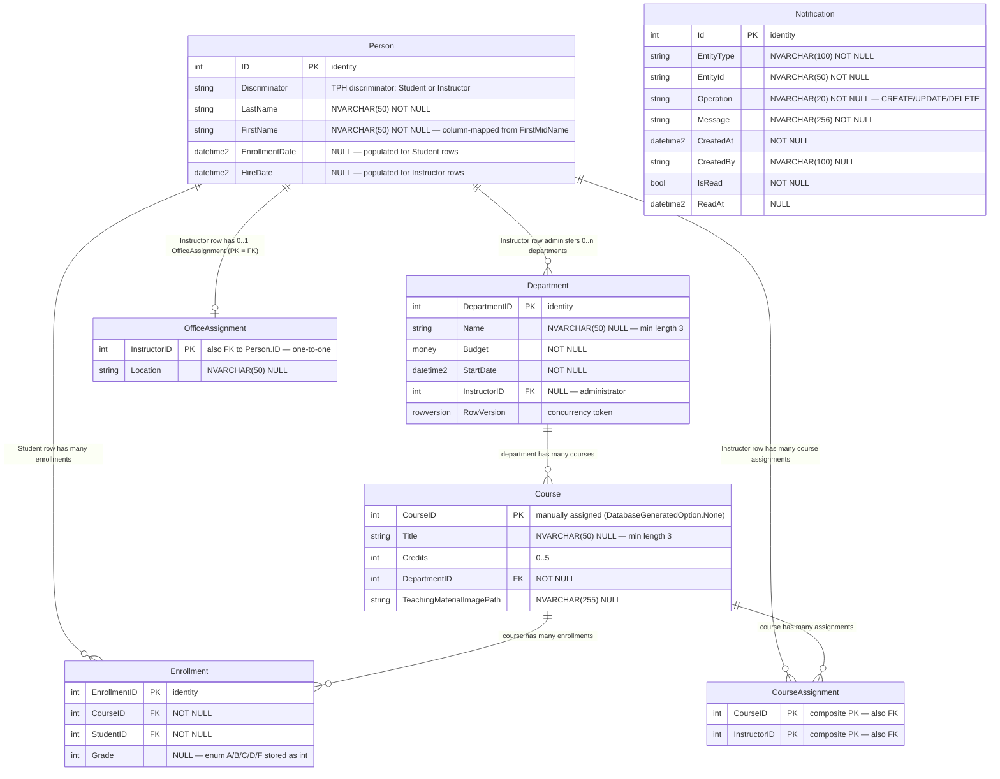

# Data Models — ContosoUniversity

_Extracted on 2026-05-13. Documents the data layer as defined in code._

> **Source of truth:** Entity classes in `src/ContosoUniversity/Models/` and the `DbContext` in `src/ContosoUniversity/Data/SchoolContext.cs`. The database schema is generated at runtime by `DbInitializer.Initialize()` via `context.Database.EnsureCreated()`. **There are no migration files** (no `Migrations/` folder, no `*.Designer.cs` files, no `__EFMigrationsHistory` table managed by the app).

---

## Data Layer Technology

| Aspect | Value |
|---|---|
| ORM | Entity Framework Core 3.1.32 |
| Database engine | Microsoft SQL Server (LocalDB in development) |
| Database name | `ContosoUniversityNoAuthEFCore` |
| Connection string source | `Web.config` → `<connectionStrings name="DefaultConnection">` |
| Connection string value | `Data Source=(LocalDb)\MSSQLLocalDB;Initial Catalog=ContosoUniversityNoAuthEFCore;Integrated Security=True;MultipleActiveResultSets=True` |
| DbContext class | `ContosoUniversity.Data.SchoolContext` |
| Schema creation method | `context.Database.EnsureCreated()` invoked from `DbInitializer.Initialize()` |
| Migration tool | None (no `dotnet ef migrations` artifacts exist in the repo) |
| Migration count | 0 |
| Default DateTime column type | `datetime2` (forced by `OnModelCreating` for **every** `DateTime` / `DateTime?` property on every entity) |
| Authentication tables | None (database name suffix `NoAuth` reflects the absence of ASP.NET Identity tables) |

---

## Entity-Relationship Diagram



> **Diagram note.** The Mermaid `erDiagram` syntax does not natively render Table-per-Hierarchy inheritance. `Student` and `Instructor` rows both live in the `Person` table and are distinguished by the `Discriminator` column. `Student.EnrollmentDate` and `Instructor.HireDate` are sparse columns (only populated for the matching subtype). The `Notification` entity stands alone with no foreign-key relationships — it is loosely coupled to other entities via the free-form `EntityType` + `EntityId` strings.

---

## Entity Catalog

### Entity: `Person` (abstract base — TPH root)

- **Source file:** `src/ContosoUniversity/Models/Person.cs`
- **Mapped table:** `Person` (configured in `OnModelCreating` via `.ToTable("Person").HasDiscriminator<string>("Discriminator")`)
- **Inheritance:** Table-per-Hierarchy (TPH) root for `Student` and `Instructor`
- **Discriminator column:** `Discriminator` (NVARCHAR), values `"Student"` and `"Instructor"`
- **Primary key:** `ID` (int, identity by EF convention)
- **Computed property:** `FullName` (read-only, returns `LastName + ", " + FirstMidName`; not mapped to a column — no `[NotMapped]` attribute, but no setter either, so EF Core ignores it)

| Field | CLR type | DB column | DB type | Nullable | Constraints | Notes |
|---|---|---|---|---|---|---|
| ID | int | ID | int | No | PK, identity | Auto-generated by EF convention |
| LastName | string | LastName | NVARCHAR(50) | No | `[Required]`, `[StringLength(50)]` | Display: "Last Name" |
| FirstMidName | string | **FirstName** | NVARCHAR(50) | No | `[Required]`, `[StringLength(50)]`, `[Column("FirstName")]` | Display: "First Name" — **CLR property name differs from column name** |

### Entity: `Student` : `Person`

- **Source file:** `src/ContosoUniversity/Models/Student.cs`
- **Mapped table:** `Person` (TPH child, `Discriminator = "Student"`)
- **Navigation:** `Enrollments` → `ICollection<Enrollment>` (lazy-loadable via `virtual`)

| Field | CLR type | DB column | DB type | Nullable | Constraints | Notes |
|---|---|---|---|---|---|---|
| EnrollmentDate | DateTime | EnrollmentDate | datetime2 | NULL on table (sparse — only set for Student rows) | `[Required]`, `[DataType(Date)]`, `[Column(TypeName = "datetime2")]`, `[Range(1/1/1753, 12/31/9999)]` | Display: "Enrollment Date" |

### Entity: `Instructor` : `Person`

- **Source file:** `src/ContosoUniversity/Models/Instructor.cs`
- **Mapped table:** `Person` (TPH child, `Discriminator = "Instructor"`)
- **Navigations:** `CourseAssignments` → `ICollection<CourseAssignment>`; `OfficeAssignment` → `OfficeAssignment` (1:1, optional)

| Field | CLR type | DB column | DB type | Nullable | Constraints | Notes |
|---|---|---|---|---|---|---|
| HireDate | DateTime | HireDate | datetime2 | NULL on table (sparse — only set for Instructor rows) | `[Required]`, `[DataType(Date)]`, `[Column(TypeName = "datetime2")]`, `[Range(1/1/1753, 12/31/9999)]` | Display: "Hire Date" |

### Entity: `Course`

- **Source file:** `src/ContosoUniversity/Models/Course.cs`
- **Mapped table:** `Course` (`.ToTable("Course")`)
- **Primary key:** `CourseID` (int, **manually assigned** — `[DatabaseGenerated(DatabaseGeneratedOption.None)]` disables identity)
- **Navigations:** `Department` → `Department`; `Enrollments` → `ICollection<Enrollment>`; `CourseAssignments` → `ICollection<CourseAssignment>`

| Field | CLR type | DB column | DB type | Nullable | Constraints | Notes |
|---|---|---|---|---|---|---|
| CourseID | int | CourseID | int | No | PK, **NOT identity** | Display: "Number" |
| Title | string | Title | NVARCHAR(50) | Yes | `[StringLength(50, MinimumLength = 3)]` | Min length 3 enforced at validation only |
| Credits | int | Credits | int | No | `[Range(0, 5)]` | Validated 0..5 |
| DepartmentID | int | DepartmentID | int | No | FK → `Department.DepartmentID` | EF inferred from navigation |
| TeachingMaterialImagePath | string | TeachingMaterialImagePath | NVARCHAR(255) | Yes | `[StringLength(255)]` | Path to uploaded file in `Uploads/` folder; display: "Teaching Material Image" |

### Entity: `Department`

- **Source file:** `src/ContosoUniversity/Models/Department.cs`
- **Mapped table:** `Department` (`.ToTable("Department")`)
- **Primary key:** `DepartmentID` (int, identity)
- **Concurrency token:** `RowVersion` (`[Timestamp]` → `rowversion` column, used by `DepartmentsController.Edit POST` for optimistic concurrency)
- **Navigations:** `Administrator` → `Instructor` (optional); `Courses` → `ICollection<Course>`

| Field | CLR type | DB column | DB type | Nullable | Constraints | Notes |
|---|---|---|---|---|---|---|
| DepartmentID | int | DepartmentID | int | No | PK, identity | |
| Name | string | Name | NVARCHAR(50) | Yes | `[StringLength(50, MinimumLength = 3)]` | |
| Budget | decimal | Budget | money | No | `[DataType(Currency)]`, `[Column(TypeName = "money")]` | |
| StartDate | DateTime | StartDate | datetime2 | No | `[DataType(Date)]` | Forced to datetime2 by `OnModelCreating` global pass |
| InstructorID | int? | InstructorID | int | Yes | FK → `Person.ID` (Instructor) | Optional — department may have no administrator |
| RowVersion | byte[] | RowVersion | rowversion | Yes (NULL allowed at column level) | `[Timestamp]` | Concurrency token |

### Entity: `Enrollment`

- **Source file:** `src/ContosoUniversity/Models/Enrollment.cs`
- **Mapped table:** `Enrollment` (`.ToTable("Enrollment")`)
- **Primary key:** `EnrollmentID` (int, identity by EF convention)
- **Navigations:** `Course` → `Course`; `Student` → `Student`

| Field | CLR type | DB column | DB type | Nullable | Constraints | Notes |
|---|---|---|---|---|---|---|
| EnrollmentID | int | EnrollmentID | int | No | PK, identity | |
| CourseID | int | CourseID | int | No | FK → `Course.CourseID` | |
| StudentID | int | StudentID | int | No | FK → `Person.ID` (Student) | |
| Grade | Grade? | Grade | int | Yes | `[DisplayFormat(NullDisplayText = "No grade")]` | Enum stored as int — values: `A=0, B=1, C=2, D=3, F=4` |

**Companion enum** (`src/ContosoUniversity/Models/Enrollment.cs`):

```csharp
public enum Grade { A, B, C, D, F }
```

### Entity: `OfficeAssignment`

- **Source file:** `src/ContosoUniversity/Models/OfficeAssignment.cs`
- **Mapped table:** `OfficeAssignment` (`.ToTable("OfficeAssignment")`)
- **Primary key:** `InstructorID` (int) — **shared PK / FK** establishing the 1:1 with `Instructor`
- **Navigation:** `Instructor` → `Instructor`
- **Relationship config in `OnModelCreating`:** `Instructor.HasOne(s => s.OfficeAssignment).WithOne(ad => ad.Instructor).HasForeignKey<OfficeAssignment>(ad => ad.InstructorID)`

| Field | CLR type | DB column | DB type | Nullable | Constraints | Notes |
|---|---|---|---|---|---|---|
| InstructorID | int | InstructorID | int | No | PK, FK → `Person.ID` (Instructor), `[Key]` | One-to-one shared key with Instructor |
| Location | string | Location | NVARCHAR(50) | Yes | `[StringLength(50)]` | Display: "Office Location" |

### Entity: `CourseAssignment` (join entity, many-to-many)

- **Source file:** `src/ContosoUniversity/Models/CourseAssignment.cs`
- **Mapped table:** `CourseAssignment` (`.ToTable("CourseAssignment")`)
- **Primary key:** **composite** `{ CourseID, InstructorID }` (configured via `.HasKey(c => new { c.CourseID, c.InstructorID })`)
- **Navigations:** `Course` → `Course`; `Instructor` → `Instructor`
- **Relationship config in `OnModelCreating`:**
  - `CourseAssignment.HasOne(m => m.Course).WithMany(t => t.CourseAssignments).HasForeignKey(m => m.CourseID)`
  - `CourseAssignment.HasOne(m => m.Instructor).WithMany(t => t.CourseAssignments).HasForeignKey(m => m.InstructorID)`

| Field | CLR type | DB column | DB type | Nullable | Constraints | Notes |
|---|---|---|---|---|---|---|
| InstructorID | int | InstructorID | int | No | Composite PK, FK → `Person.ID` (Instructor) | |
| CourseID | int | CourseID | int | No | Composite PK, FK → `Course.CourseID` | |

### Entity: `Notification`

- **Source file:** `src/ContosoUniversity/Models/Notification.cs`
- **Mapped table:** `Notification` (`.ToTable("Notification")`)
- **Primary key:** `Id` (int, identity, `[Key]`)
- **No foreign keys.** Other entities are referenced as opaque strings via `EntityType` and `EntityId`.
- **Dual-purpose data:** `Notification` instances are **also** the message payload that flows through the in-process `NotificationQueueService` shim (see `specs/docs/architecture/components.md` §Notification Pipeline). The same CLR type is enqueued in memory and persisted to SQL.

| Field | CLR type | DB column | DB type | Nullable | Constraints | Notes |
|---|---|---|---|---|---|---|
| Id | int | Id | int | No | PK, identity, `[Key]` | |
| EntityType | string | EntityType | NVARCHAR(100) | No | `[Required]`, `[StringLength(100)]` | E.g., "Student", "Course" |
| EntityId | string | EntityId | NVARCHAR(50) | No | `[Required]`, `[StringLength(50)]` | Loose reference, no FK |
| Operation | string | Operation | NVARCHAR(20) | No | `[Required]`, `[StringLength(20)]` | Free-form string; `EntityOperation` enum exists but is not used for column type |
| Message | string | Message | NVARCHAR(256) | No | `[Required]`, `[StringLength(256)]` | |
| CreatedAt | DateTime | CreatedAt | datetime2 | No | `[Required]`, `[Column(TypeName = "datetime2")]` | |
| CreatedBy | string | CreatedBy | NVARCHAR(100) | Yes | `[StringLength(100)]` | Set by `BaseController` to hardcoded `"System"` |
| IsRead | bool | IsRead | bit | No | — | Default is CLR default (`false`) |
| ReadAt | DateTime? | ReadAt | datetime2 | Yes | `[Column(TypeName = "datetime2")]` | Set when `NotificationsController.MarkAsRead` is called |

**Companion enum** (`src/ContosoUniversity/Models/Notification.cs`):

```csharp
public enum EntityOperation { CREATE, UPDATE, DELETE }
```

> The enum is defined alongside the entity but is not referenced by the `Operation` column, which is `string` not `EntityOperation`. Calling code passes string literals (e.g., `"CREATE"`).

---

## Relationship Summary

| Source entity | Target entity | Type | FK column | Configured in | Cascade | Required |
|---|---|---|---|---|---|---|
| Student (Person) | Enrollment | One-to-many | `Enrollment.StudentID` | EF convention | Default (Cascade for required FK) | Required |
| Course | Enrollment | One-to-many | `Enrollment.CourseID` | EF convention | Default (Cascade for required FK) | Required |
| Department | Course | One-to-many | `Course.DepartmentID` | EF convention | Default (Cascade for required FK) | Required |
| Instructor (Person) | Department | One-to-many (optional) | `Department.InstructorID` | EF convention | Default (SetNull/Restrict for optional FK) | Optional (`int?`) |
| Instructor (Person) | OfficeAssignment | One-to-one (optional) | `OfficeAssignment.InstructorID` (PK = FK) | `OnModelCreating` explicit `HasOne/WithOne` | Default | Optional |
| Instructor (Person) | CourseAssignment | One-to-many | `CourseAssignment.InstructorID` | `OnModelCreating` explicit `HasOne/WithMany` | Default | Required (composite PK) |
| Course | CourseAssignment | One-to-many | `CourseAssignment.CourseID` | `OnModelCreating` explicit `HasOne/WithMany` | Default | Required (composite PK) |

> **Note on cascade behavior.** Cascade rules are not explicitly declared anywhere in the codebase. They follow EF Core 3.1 defaults: `DeleteBehavior.Cascade` for required relationships and `DeleteBehavior.ClientSetNull` for optional relationships. No `.OnDelete(DeleteBehavior.X)` calls exist in `OnModelCreating`.

---

## Indexes and Constraints

The codebase declares **no explicit indexes** beyond those EF Core auto-creates for primary keys and foreign keys. There are no `[Index]` attributes, no `.HasIndex(...)` fluent calls, no unique constraints other than primary keys, and no check constraints.

| Index/Constraint | Entity | Columns | Type | Source |
|---|---|---|---|---|
| `PK_Person` | Person | `ID` | Primary key | EF convention |
| `PK_Course` | Course | `CourseID` | Primary key (non-identity) | EF convention + `[DatabaseGenerated(None)]` |
| `PK_Department` | Department | `DepartmentID` | Primary key | EF convention |
| `PK_Enrollment` | Enrollment | `EnrollmentID` | Primary key | EF convention |
| `PK_OfficeAssignment` | OfficeAssignment | `InstructorID` | Primary key (also FK) | `[Key]` attribute + `OnModelCreating` |
| `PK_CourseAssignment` | CourseAssignment | `{CourseID, InstructorID}` | Composite primary key | `OnModelCreating` `.HasKey(...)` |
| `PK_Notification` | Notification | `Id` | Primary key | `[Key]` attribute |
| FK indexes | All entities with FKs | Foreign-key columns | Auto-created by EF when generating SQL | EF convention |
| Concurrency token | Department | `RowVersion` | `rowversion` column | `[Timestamp]` attribute |

---

## Validation Constraints (model-level only)

These are enforced by `ModelState.IsValid` in controllers, not by the database (NVARCHAR `MAX` is the SQL-side default and `MinimumLength` is application-only).

| Entity.Field | Annotation | Rule |
|---|---|---|
| Person.LastName | `[Required]`, `[StringLength(50)]` | Required, max 50 |
| Person.FirstMidName | `[Required]`, `[StringLength(50, ErrorMessage = "First name cannot be longer than 50 characters.")]` | Required, max 50 |
| Student.EnrollmentDate | `[Required]`, `[Range(1/1/1753, 12/31/9999)]` | Required, year between 1753 and 9999 |
| Instructor.HireDate | `[Required]`, `[Range(1/1/1753, 12/31/9999)]` | Required, year between 1753 and 9999 |
| Course.Title | `[StringLength(50, MinimumLength = 3)]` | Optional, length 3..50 |
| Course.Credits | `[Range(0, 5)]` | 0..5 |
| Course.TeachingMaterialImagePath | `[StringLength(255)]` | Max 255 |
| Department.Name | `[StringLength(50, MinimumLength = 3)]` | Optional, length 3..50 |
| OfficeAssignment.Location | `[StringLength(50)]` | Optional, max 50 |
| Notification.EntityType | `[Required]`, `[StringLength(100)]` | Required, max 100 |
| Notification.EntityId | `[Required]`, `[StringLength(50)]` | Required, max 50 |
| Notification.Operation | `[Required]`, `[StringLength(20)]` | Required, max 20 |
| Notification.Message | `[Required]`, `[StringLength(256)]` | Required, max 256 |
| Notification.CreatedBy | `[StringLength(100)]` | Optional, max 100 |

---

## Schema Generation, Not Migrations

The application has **no migration history**:

- No `Migrations/` directory.
- No `*.Designer.cs` files.
- No `__EFMigrationsHistory` table managed by the app.
- No `dotnet ef migrations add` artifacts.
- `packages.config` references EF Core 3.1.32 packages but does **not** include `Microsoft.EntityFrameworkCore.Tools` for migrations tooling.

Schema creation runs through `DbInitializer.Initialize(SchoolContext)`:

1. `context.Database.EnsureCreated()` — creates all tables, columns, PKs, FKs from model metadata if they do not already exist.
2. Seeds data (see "Seed Data" section below) only when the `Students` table is empty.

This is invoked from the application bootstrap path (see `Global.asax.cs` / `App_Start` per `specs/docs/architecture/components.md`).

> **Implication:** the live database schema is whatever `EnsureCreated()` derived from the current model classes the last time it ran against an empty database. There is no record of how the schema evolved over time and no rollback/forward path encoded in the repository.

---

## Model vs Migration Discrepancies

Not applicable — there are no migrations to compare against. The model classes are the only source of schema definition.

---

## Seed Data

Seed data is hard-coded in `src/ContosoUniversity/Data/DbInitializer.cs` (`DbInitializer.Initialize`) and runs only when `context.Students.Any()` returns false.

| Entity | Rows seeded | Notes |
|---|---|---|
| Student (Person, Discriminator = "Student") | 8 | Carson Alexander, Meredith Alonso, Arturo Anand, Gytis Barzdukas, Yan Li, Peggy Justice, Laura Norman, Nino Olivetto |
| Instructor (Person, Discriminator = "Instructor") | 5 | Kim Abercrombie, Fadi Fakhouri, Roger Harui, Candace Kapoor, Roger Zheng |
| Department | 4 | English (Abercrombie), Mathematics (Fakhouri), Engineering (Harui), Economics (Kapoor); each with Budget and StartDate `2007-09-01` |
| Course | 7 | 1050 Chemistry, 4022 Microeconomics, 4041 Macroeconomics, 1045 Calculus, 3141 Trigonometry, 2021 Composition, 2042 Literature |
| OfficeAssignment | 3 | Fakhouri → "Smith 17", Harui → "Gowan 27", Kapoor → "Thompson 304" (Abercrombie and Zheng have no office assignment) |
| CourseAssignment | 8 | (Chemistry, Kapoor), (Chemistry, Harui), (Microeconomics, Zheng), (Macroeconomics, Zheng), (Calculus, Fakhouri), (Trigonometry, Harui), (Composition, Abercrombie), (Literature, Abercrombie) |
| Enrollment | 11 | Various student/course/grade combinations; one Anand–Chemistry enrollment has no grade |
| Notification | 0 | No seed; rows accumulate via runtime CRUD operations |

There is no factory framework, no fixture loader, and no per-environment seed differentiation. The same `DbInitializer.Initialize` runs in every environment that bootstraps the application.

---

## Non-Persisted View Models

The `Models/SchoolViewModels/` folder contains DTOs used for projections and view binding. These are **not** entities and are not part of the database schema:

| Type | File | Purpose |
|---|---|---|
| `EnrollmentDateGroup` | `Models/SchoolViewModels/EnrollmentDateGroup.cs` | Aggregation result (count of students by enrollment date) for `Home/About` |
| `InstructorIndexData` | `Models/SchoolViewModels/InstructorIndexData.cs` | Composite view model bundling `Instructor`, `Course`, `Enrollment` collections for `Instructors/Index` |
| `AssignedCourseData` | `Models/SchoolViewModels/AssignedCourseData.cs` | Course assignment grid row used by `Instructors/Edit` |

The `Models/ErrorViewModel.cs` type is an MVC view model for the global error view — also not persisted.

---

## DbContext Surface

`SchoolContext` (`src/ContosoUniversity/Data/SchoolContext.cs`) exposes the following `DbSet<T>` properties:

| DbSet property | Entity type |
|---|---|
| `Courses` | `Course` |
| `Enrollments` | `Enrollment` |
| `Departments` | `Department` |
| `OfficeAssignments` | `OfficeAssignment` |
| `CourseAssignments` | `CourseAssignment` |
| `People` | `Person` (TPH base — queries return both Students and Instructors) |
| `Students` | `Student` (TPH filter — queries return only `Discriminator = "Student"`) |
| `Instructors` | `Instructor` (TPH filter — queries return only `Discriminator = "Instructor"`) |
| `Notifications` | `Notification` |

`SchoolContextFactory.cs` exists alongside `SchoolContext.cs` and is referenced by `BaseController` to obtain a `SchoolContext` instance per request.

---

## Cross-Reference

- **Components** that read/write each entity: see `specs/docs/architecture/components.md`.
- **API endpoints** that operate on each entity: see `specs/contracts/api/{students,courses,instructors,departments,notifications}.yaml`.
- **Notification dual role** (entity + in-memory queue payload): see `specs/docs/architecture/components.md` § Notification Pipeline.
