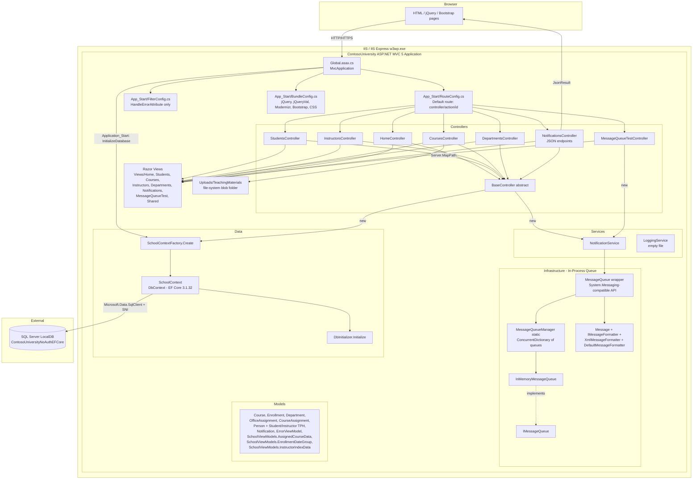
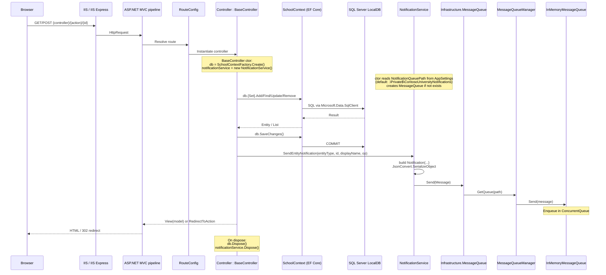
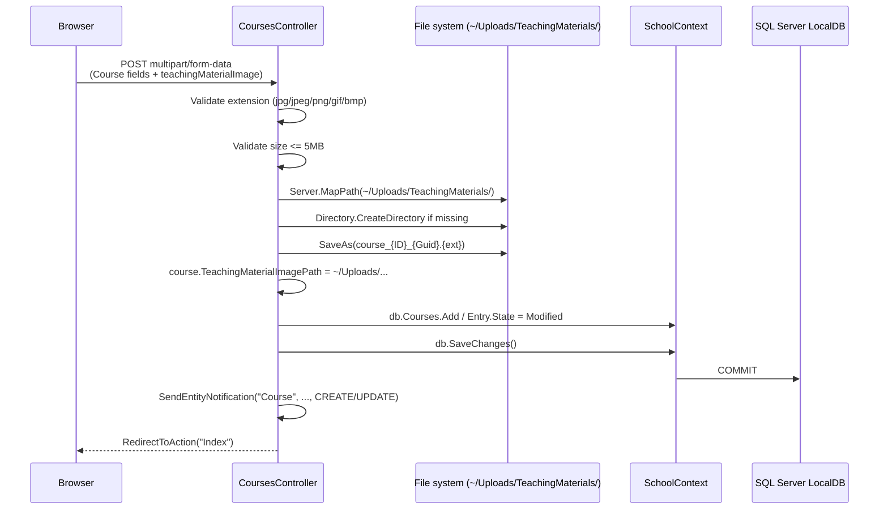

# Architecture Overview — ContosoUniversity

_Extracted on 2026-05-13. Documents the architecture as it exists in code._

## System Boundaries

A single deployable web application:

| Application | Runtime | Entry Point | Deployment Artifact |
|-------------|---------|-------------|---------------------|
| `ContosoUniversity` | .NET Framework 4.8.2 (full CLR, 32/64-bit IIS process) | `Global.asax` → `Global.asax.cs` (`MvcApplication.Application_Start`) | ASP.NET site hosted by IIS / IIS Express. The legacy `.csproj` produces an in-place web layout (the `bin/` folder + content files), not a self-contained executable. There is no Dockerfile, no Bicep, no `azure.yaml`. |

There are no separate worker processes, separate background services, separate frontends, or microservices. The README, controllers, services, infrastructure layer, and data layer all run in the same `w3wp.exe` / `iisexpress.exe` worker process under one `AppDomain`.

## High-Level Architecture

### Component Diagram



### Prose Description

The application is an ASP.NET MVC 5 monolith on .NET Framework 4.8.2. Bootstrap occurs in `Global.asax.cs:MvcApplication.Application_Start`, which (1) registers areas, global filters, routes, and bundles; (2) constructs a `SchoolContext` (EF Core 3.1.32) directly inside `InitializeDatabase()` and calls `DbInitializer.Initialize(context)` to seed the database.

There is no inversion-of-control container wired into the MVC pipeline. Each controller (except `MessageQueueTestController`) inherits from the abstract `BaseController`, whose constructor instantiates a fresh `SchoolContext` (via `SchoolContextFactory.Create()`) and a fresh `NotificationService` per request. Both are released in the controller's `Dispose(bool)` override.

The single domain service that contains code is `NotificationService`. `LoggingService.cs` exists but is a zero-byte empty file. Every CRUD action in `StudentsController`, `InstructorsController`, `CoursesController`, and `DepartmentsController` calls `BaseController.SendEntityNotification(...)` after a successful `db.SaveChanges()`. The user name attached to the notification is hard-coded to `"System"` in `BaseController` (`// No authentication, use System as default user`).

The `Infrastructure/` namespace contains a custom message-queue abstraction whose surface API mirrors `System.Messaging` (it exposes `MessageQueue.Create`, `Exists`, `Delete`, `Send`, `Receive`, `Peek`, `Purge`, `XmlMessageFormatter`, `MessagePriority`, etc.) but whose implementation is **in-process** (`InMemoryMessageQueue` wraps a `ConcurrentQueue<QueueMessage>`; `MessageQueueManager` keeps a static `ConcurrentDictionary<string, IMessageQueue>`). `NotificationService` references `ContosoUniversity.Infrastructure.MessageQueue`, not `System.Messaging.MessageQueue`. The XML doc-comment on `Infrastructure/MessageQueue.cs` reads: *"Compatibility layer for System.Messaging.MessageQueue — This provides a drop-in replacement that doesn't require MSMQ"*.

`MessageQueueTestController` is an in-app diagnostics page that creates a queue, sends two messages, receives them, and deletes the queue (in addition to listing all currently-known queues). It does not inherit `BaseController` and instantiates `NotificationService` directly.

Razor views (`.cshtml`) under `Views/` produce the HTML responses. `App_Start/BundleConfig.cs` declares 5 bundles using `Microsoft.AspNet.Web.Optimization` (which transitively brings in `WebGrease` for minification). `NotificationsController.GetNotifications` returns `JsonResult` (drains up to 10 notifications from the in-memory queue and returns them); `MarkAsRead(int id)` is a no-op (the body of `NotificationService.MarkAsRead` is empty with a comment noting that DB persistence is not implemented).

`CoursesController.Create` and `Edit` accept an `HttpPostedFileBase teachingMaterialImage` and write it to `~/Uploads/TeachingMaterials/course_{CourseID}_{Guid}.{ext}` via `Server.MapPath`. The folder is created on demand. Allowed extensions are `.jpg`, `.jpeg`, `.png`, `.gif`, `.bmp`. Maximum size is 5 MB.

The persistence layer is EF Core 3.1.32 against SQL Server (`Microsoft.Data.SqlClient` + `Microsoft.EntityFrameworkCore.SqlServer`). `SchoolContext` declares 9 `DbSet<>` properties (`Courses`, `Enrollments`, `Departments`, `OfficeAssignments`, `CourseAssignments`, `People`, `Students`, `Instructors`, `Notifications`) and configures a Table-per-Hierarchy mapping for `Person` with discriminator `Discriminator` and values `"Student"` / `"Instructor"`. All `DateTime` columns are forced to `datetime2`. `CourseAssignment` has a composite key `(CourseID, InstructorID)`. `Instructor`-`OfficeAssignment` is a 1-to-1 relationship.

The connection string `DefaultConnection` is read by both `Global.asax.cs:InitializeDatabase()` and `SchoolContextFactory.Create()` from `<connectionStrings>` in `Web.config`. (The recorded value in `Web.config` is `Server=(localdb)\\MSSQLLocalDB;Database=ContosoUniversityNoAuthEFCore;Trusted_Connection=True;MultipleActiveResultSets=true` — see `dependencies.md` and `stack.md` for source.)

## Data Flow

### Primary Request Flow — CRUD action with notification



### Notification Read Flow — admin polls JSON endpoint

```mermaid
sequenceDiagram
    participant Browser
    participant Notif as NotificationsController
    participant NS as NotificationService
    participant MQ as Infrastructure.MessageQueue
    participant MQM as MessageQueueManager
    participant Q as InMemoryMessageQueue

    loop until null or count == 10
        Browser->>Notif: GET /Notifications/GetNotifications
        Notif->>NS: ReceiveNotification()
        NS->>MQ: Receive(TimeSpan.FromSeconds(1))
        MQ->>MQM: GetQueue(path)
        MQM->>Q: Receive(timeout)
        Note over Q: Dequeue from ConcurrentQueue;<br/>throws TimeoutException if empty
        Q-->>MQ: QueueMessage
        MQ-->>NS: Message
        NS->>NS: JsonConvert.DeserializeObject<Notification>
        NS-->>Notif: Notification or null
    end
    Notif-->>Browser: Json({success, notifications, count})
```

### File Upload Flow — Courses Create/Edit with teaching-material image



### Application Start-up Flow

```mermaid
sequenceDiagram
    participant IIS
    participant MvcApp as MvcApplication
    participant AreaReg as AreaRegistration
    participant FilterConfig
    participant RouteConfig
    participant BundleConfig
    participant Init as DbInitializer
    participant Ctx as SchoolContext
    participant SQL as SQL Server LocalDB

    IIS->>MvcApp: Application_Start()
    MvcApp->>AreaReg: RegisterAllAreas()
    MvcApp->>FilterConfig: RegisterGlobalFilters(GlobalFilters.Filters)
    Note over FilterConfig: only HandleErrorAttribute is added
    MvcApp->>RouteConfig: RegisterRoutes(RouteTable.Routes)
    Note over RouteConfig: ignore axd; default route<br/>{controller=Home}/{action=Index}/{id?}
    MvcApp->>BundleConfig: RegisterBundles(BundleTable.Bundles)
    MvcApp->>MvcApp: InitializeDatabase()
    MvcApp->>Ctx: new SchoolContext(UseSqlServer(connStr))
    MvcApp->>Init: DbInitializer.Initialize(context)
    Init->>SQL: ensure schema + seed data
```

## Integration Points

| # | Type | Technology | Module(s) That Use It | Configuration Source |
|---|------|------------|------------------------|----------------------|
| 1 | Database | SQL Server (LocalDB by default) via EF Core 3.1.32 + `Microsoft.Data.SqlClient` 2.1.4 | `Data/SchoolContext.cs`, `Data/SchoolContextFactory.cs`, `Data/DbInitializer.cs`, `Global.asax.cs:InitializeDatabase`, all `BaseController`-derived controllers via `db` field | `Web.config` `<connectionStrings name="DefaultConnection">` (read via `ConfigurationManager.ConnectionStrings`) |
| 2 | In-process message queue | Custom in-memory queue (`Infrastructure.InMemoryMessageQueue`, `MessageQueueManager`) — API-compatible shim that mimics `System.Messaging.MessageQueue` | `Services/NotificationService.cs`, `Controllers/NotificationsController.cs`, `Controllers/MessageQueueTestController.cs`, `Examples/MessageQueueExample.cs` | `Web.config` `<appSettings name="NotificationQueuePath">` (default fallback `.\Private$\ContosoUniversityNotifications` hard-coded in `NotificationService` constructor). The path string is normalized by `MessageQueueManager.NormalizeQueuePath` and used only as a dictionary key — there is no out-of-process MSMQ traffic |
| 3 | File system blob storage | `System.IO.File`, `Directory`, `HttpPostedFileBase.SaveAs`, `Server.MapPath` | `Controllers/CoursesController.cs` (Create + Edit + DeleteConfirmed) | Hard-coded path `~/Uploads/TeachingMaterials/` rooted at the web app physical path |
| 4 | Native SNI (TDS) library | `Microsoft.Data.SqlClient.SNI` (x64/x86 native DLLs) | `Microsoft.Data.SqlClient` runtime | Copied into `bin/x64/` and `bin/x86/` by the `CopySQLClientNativeBinaries` MSBuild target in `ContosoUniversity.csproj` |
| 5 | Authentication library (referenced, not invoked) | `Microsoft.Identity.Client` 4.21.1 (MSAL.NET) | Listed as a `<Reference>` and resolved into `bin/Microsoft.Identity.Client.dll`. No direct usages of `IConfidentialClientApplication`, `IPublicClientApplication`, `AuthenticationResult`, or `AcquireToken*` were found in the application code | Brought in transitively by `Microsoft.Data.SqlClient` 2.1.4 to support Active-Directory / Entra-ID authentication modes for SQL Server. The current `DefaultConnection` uses `Trusted_Connection=True`, so MSAL is not exercised at runtime |
| 6 | IIS / IIS Express host | ASP.NET classic pipeline managed handler (`integratedMode`) | `Web.config` `<system.webServer>` + `applicationHost.config` (`launchSettings`/`vs:VirtualPath` in `csproj.user`) | `ContosoUniversity.csproj.user` records `IISExpressSSLPort=44300`, `DevelopmentServerPort=58801`, Windows authentication enabled. Production hosting target is unspecified (no `publishProfiles/`, no Dockerfile, no `azure.yaml`) |
| 7 | Outbound HTTP | None observed | — | — |
| 8 | Cache | None observed (`Microsoft.Extensions.Caching.Memory` is referenced transitively by EF Core but not used directly in application code) | — | — |
| 9 | CDN / cloud blob storage | None observed (uploads live on the local file system) | — | — |
| 10 | Telemetry / APM / structured logging | None observed. The only logging calls are `System.Diagnostics.Trace.TraceError` (in `StudentsController` catch blocks) and `System.Diagnostics.Debug.WriteLine` (in `BaseController`, `NotificationService`, `NotificationsController`, `CoursesController`, `MessageQueueTestController`). `Services/LoggingService.cs` is a zero-byte file. | — |
| 11 | Email / SMS | None observed | — | — |
| 12 | Search engine | None observed | — | — |

## Architectural Patterns Observed

| Pattern | Evidence |
|---------|----------|
| **MVC** (Model-View-Controller, ASP.NET MVC 5 flavour) | `Microsoft.AspNet.Mvc 5.2.9` referenced; project type GUID `{349c5851-65df-11da-9384-00065b846f21}` (MVC) in `csproj`; folder layout `Controllers/`, `Models/`, `Views/`; controllers inherit `System.Web.Mvc.Controller`; views are Razor `.cshtml` |
| **Single deployable monolith** | One `.csproj`, one `bin/` output, one `Global.asax`, one `Web.config`, one `AppDomain` at runtime. No worker projects, no other csproj files |
| **Per-request transient `DbContext`** (manual, not via DI) | `BaseController` ctor `db = SchoolContextFactory.Create();` and `Dispose(bool)` releases it. No `IServiceProvider` or `Microsoft.Extensions.DependencyInjection` container is registered with MVC |
| **Service-oriented action methods** (thin services layer) | Two service classes declared (`NotificationService`, `LoggingService`); only `NotificationService` contains code. Controllers call services directly, not through interfaces |
| **In-process pub/sub (queue) abstraction** | `IMessageQueue` interface + `InMemoryMessageQueue` implementation + `MessageQueueManager` static registry. The publish side (`SendEntityNotification`) lives in `BaseController` and is invoked by all CRUD controllers; the consume side (`ReceiveNotification`) lives in `NotificationsController.GetNotifications` (drain-on-poll). Storage is a `ConcurrentQueue` per queue name; messages do not survive an `AppDomain` recycle |
| **Server-rendered Razor views with bundled client assets** | `App_Start/BundleConfig.cs` registers `~/bundles/jquery`, `~/bundles/jqueryval`, `~/bundles/modernizr`, `~/bundles/bootstrap`, `~/Content/css`. jQuery / jQuery.Validation / Modernizr / Bootstrap come from NuGet content packages |
| **EF Core code-first with Table-per-Hierarchy inheritance** | `SchoolContext.OnModelCreating` configures `Person` TPH with discriminator and maps `Student`/`Instructor` to single `Person` table; composite key on `CourseAssignment`; explicit `ToTable(...)` calls |
| **File-system blob storage for uploaded content** | `CoursesController` writes to `~/Uploads/TeachingMaterials/` rooted at the web app physical path; the `Uploads/TeachingMaterials/` folder contains an example file already (`course_1045_2b7f6522-…jpg`) |
| **Compatibility-shim pattern (façade with replaced implementation)** | `Infrastructure/MessageQueue.cs` exposes the same public surface as `System.Messaging.MessageQueue` (`Create`, `Exists`, `Delete`, `Send`, `Receive`, `Peek`, `Purge`, `Formatter`, `XmlMessageFormatter`, `MessagePriority`) but routes all calls to `MessageQueueManager` + `InMemoryMessageQueue`. `Services/NotificationService.cs` `using ContosoUniversity.Infrastructure;` (not `System.Messaging`) |

### Patterns/components NOT observed (factually noted, not as gaps)

- No `IServiceCollection` / `IServiceProvider` wired into MVC (no DI container).
- No interfaces are used for the data context or notification service (controllers depend on concrete `SchoolContext` and `NotificationService`).
- No async controller actions (every action returns `ActionResult` synchronously; EF queries are synchronous via `.Single()`, `.ToList()`, `.Find()`).
- No CQRS, no MediatR, no event sourcing.
- No background workers, no scheduled jobs, no `IHostedService`.
- No middleware pipeline (the application uses the classic MVC `HandleErrorAttribute` only).
- No HTTP outbound calls, no SDK usage of cloud services in application code.
- No automated test project (see `specs/docs/testing/coverage.md` once produced).

## Notes on Discrepancies Between Documentation and Code

- The `bin/` folder ships the assembly XML doc-comment for `Infrastructure/MessageQueue.cs` describing it as a *"compatibility layer for `System.Messaging.MessageQueue`"*. Despite the `csproj` referencing `<Reference Include="System.Messaging" />` and `Web.config` `<appSettings name="NotificationQueuePath" value=".\Private$\ContosoUniversityNotifications" />` looking like an MSMQ path, the actual runtime path goes through `Infrastructure.InMemoryMessageQueue` (in-process) — confirmed by tracing `using ContosoUniversity.Infrastructure;` in `NotificationService.cs` and reading `MessageQueueManager`.
- `BaseController.cs` comment says *"// No authentication, use System as default user"* and the user name on every notification is hard-coded to `"System"`. `FilterConfig.cs` has a comment *"Remove the global authorization filter since we're implementing role-based authorization"*. No `[Authorize]` attributes were observed on the read controllers (`HomeController`, `StudentsController`, `InstructorsController`, `CoursesController`, `DepartmentsController`, `NotificationsController`, `MessageQueueTestController`). `Web.config` has Windows authentication enabled at the IIS Express level, but the application does not consume the principal beyond `User.Identity.Name ?? "TestUser"` in `MessageQueueTestController.SendTestNotification`.
- `Services/LoggingService.cs` is a zero-byte file. No code references it.
- `csproj` lists `ROLE_SETUP_GUIDE.md` as a `<None>` item, but the file does not exist on disk.
- `Examples/MessageQueueExample.cs` is included as a `<Compile>` item and therefore compiles into the production assembly.
