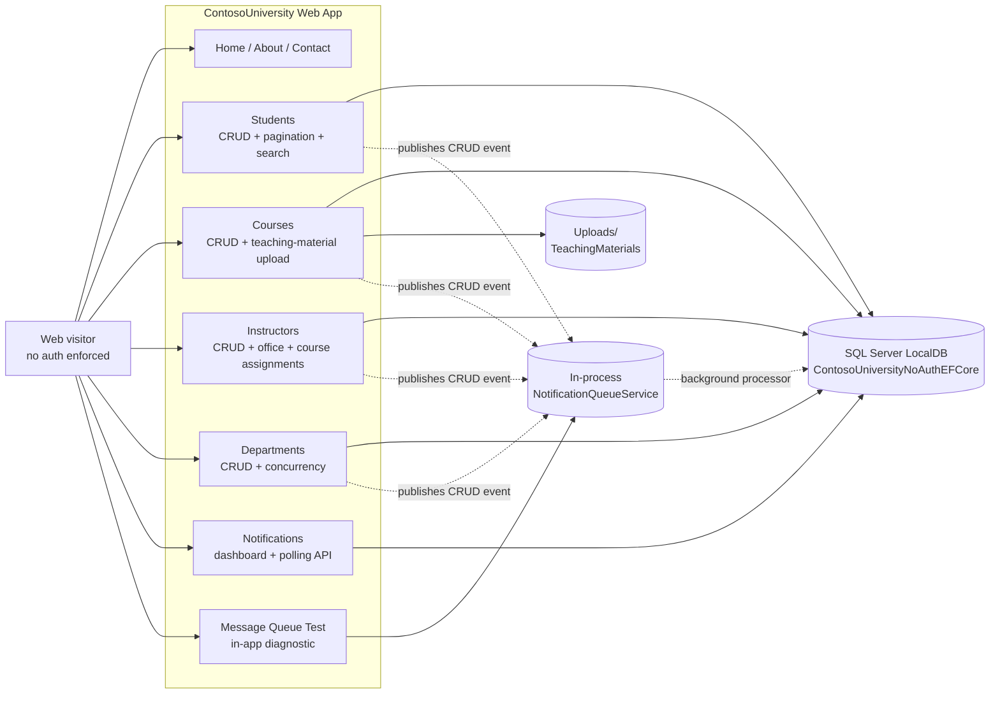

# Product Requirements Document — ContosoUniversity

_Reverse-engineered on 2026-05-13 from the existing codebase under `src/ContosoUniversity`. This is a brownfield-extracted PRD: every claim is traceable to source files, configuration, or extraction outputs. Where intent is inferred rather than explicit, the entry is prefixed with **Inferred:** and includes the reasoning._

---

## Product Flow Diagram



> The diagram reflects the **actual** implementation. It intentionally diverges from the documentation's "admin-only / Windows Authentication / MSMQ" framing — see §Discrepancies.

---

## Product Vision

ContosoUniversity is a **single-tenant web-based university administration application** that lets staff manage the core records of a small academic institution: students, courses, instructors, departments, and the relationships among them (enrollments, course assignments, office assignments). The application also includes an **in-app real-time activity feed** that surfaces create/update/delete events to anyone viewing the Notifications dashboard, plus a course-level **teaching-material image upload** feature.

The product is delivered as an ASP.NET MVC 5 web application running on .NET Framework 4.8.2, backed by SQL Server LocalDB through Entity Framework Core 3.1.32. It runs locally in IIS Express at `https://localhost:44300/` and is structured as a single project. There is no public deployment target encoded in the repository.

> **Inferred:** The product is closely modeled on Microsoft's classic "Contoso University" Entity Framework tutorial sample, extended with three additions visible in the source tree: (1) a teaching-material image upload feature on Courses, (2) an entity-CRUD notification subsystem, and (3) an in-app message-queue diagnostic page. The repository has no marketing copy, business plan, or commercial deployment artifacts — it appears to be a sample/teaching application that has been progressively extended.

---

## User Personas

### Anonymous Web User (de facto)

- **Role:** Any browser that can reach `https://localhost:44300/`.
- **Needs:** Browse and modify all university records.
- **Goals:** Read or change any data the application stores.
- **Source:** **Explicit in code.** `BaseController` (the parent of seven of the eight controllers) does not call any authentication API and hardcodes the audit-trail value `userName = "System"` regardless of caller. There are no `[Authorize]` attributes anywhere in the codebase. There are no ASP.NET Identity tables (the database is named `ContosoUniversityNoAuthEFCore`). MSAL 4.21.1 is referenced in `packages.config` but never invoked. **Anyone who can reach the URL is implicitly granted full CRUD on every entity.**

### Administrator (claimed by documentation, not enforced by code)

- **Role:** Staff member who, per the README and `SETUP_TESTING_GUIDE.md`, is expected to log in with a Windows account that belongs to an administrator role and receive notifications scoped to that role.
- **Needs:** Manage all entities; receive real-time alerts when others modify data.
- **Goals:** Maintain academic records and observe system activity.
- **Source:** **Inferred from documentation only.** `NOTIFICATION_SYSTEM_README.md` states the notification system is "admin-only" and the front-end CSS/JS is supposedly "admin-only inclusion of notification assets." However, the runtime code applies no role check: `NotificationsController.GetNotifications` returns all unread notifications to any caller. The "Administrator" persona is therefore a **documented intention** that does not match the implementation.

### Operator / Developer (in-app diagnostics user)

- **Role:** Whoever exercises `MessageQueueTestController` to verify the notification queue plumbing.
- **Needs:** Send a test notification, drain the queue, and observe queue depth/state from a browser.
- **Goals:** Confirm the in-process queue is functioning after a deploy or configuration change.
- **Source:** **Explicit in code.** `Controllers/MessageQueueTestController.cs` exposes 5 actions (`Index`, `SendTestNotification`, `ReceiveNotifications`, `TestBasicQueue`, `GetQueueStatus`) compiled into the production application. No auth gate. Documented in `README_MessageQueue.md`.

---

## Feature List

| ID | Feature | Description | Priority | Dependencies |
|---|---|---|---|---|
| F-001 | Student Management | CRUD for students with paging, sorting, and free-text search on first/last name. Backed by `Person` (TPH discriminator `Student`). 8 controller actions across `StudentsController` + `Views/Students/*`. | P0 | F-006 (publishes notifications) |
| F-002 | Course Management | CRUD for courses with manually-assigned `CourseID` (non-identity PK), department selection, and per-course teaching-material image upload (JPG/PNG/GIF/BMP, ≤ 5 MB, stored in `Uploads/TeachingMaterials/`). 7 controller actions across `CoursesController`. | P0 | F-004, F-006 |
| F-003 | Instructor Management | CRUD for instructors (TPH `Instructor`) with optional office assignment (1:1 shared-PK with `OfficeAssignment`) and many-to-many course assignments via the join entity `CourseAssignment`. The `Edit` view bundles `InstructorIndexData` so course checkboxes can be set in one form. 6 controller actions across `InstructorsController`. | P0 | F-002, F-006 |
| F-004 | Department Management | CRUD for academic departments. Each department has an optional administrator (`Instructor` reference), a budget (`money`), a start date, and a `RowVersion` concurrency token used by `Edit POST` to detect mid-edit conflicts and present a merge form. 7 controller actions across `DepartmentsController`. | P0 | F-003, F-006 |
| F-005 | Enrollment Statistics | A single read-only view (`Home/About`) that groups enrollments by date and shows the count of students per enrollment date using the `EnrollmentDateGroup` view model. | P2 | F-001 |
| F-006 | Real-Time Notification System | Cross-cutting subsystem. CRUD operations on F-001/F-002/F-003/F-004 publish a `Notification` to an **in-process** `NotificationQueueService`. A background processor persists each `Notification` to SQL via `NotificationsController.GetNotifications`. The dashboard page `/Notifications/Index` polls every 30 seconds and displays unread items in a top-right toast UI styled by `Content/notifications.css`. 3 controller actions in `NotificationsController` (`Index`, `GetNotifications`, `MarkAsRead`). | P1 | F-001, F-002, F-003, F-004 |
| F-007 | Queue Diagnostic Tools | In-app diagnostic page (`/MessageQueueTest/Index`) that lets an operator send a synthetic notification, drain the queue, and inspect counts. Compiled into the production application; not an automated test. 5 controller actions in `MessageQueueTestController`. | P3 | F-006 |
| F-008 | Static Pages | `Home/Index`, `Home/About`, `Home/Contact`, and a global `Error` view. Trivial Razor templates with no behavior. | P3 | — |

> **Priority assignment basis.** P0 = full CRUD path, end-to-end controller→view→DB wiring, exercised in seed data and visible in main navigation. P1 = fully implemented cross-cutting subsystem. P2 = fully implemented but a single read-only screen. P3 = present and reachable but auxiliary. **No formal product backlog exists** — these priorities are inferred from code completeness and visibility in the navigation menu.

---

## Non-Functional Requirements

### Performance

- **Pagination** — `StudentsController.Index` paginates results 3 per page using `PaginatedList<T>` (a custom helper at the project root).
- **No HTTP-level caching** — There is no `OutputCache` attribute, no `ResponseCache`, no `Cache-Control` header configuration in `Web.config`.
- **In-process memory cache** — `Microsoft.Extensions.Caching.Memory` is referenced but no `IMemoryCache` injection or usage was found in the controllers extracted under B1d.
- **No CDN, no rate limiter, no load-test artifacts** — Nothing in the repository configures request-rate limits or load profiles.
- **Notification polling cadence** — `Scripts/notifications.js` (referenced by the layout) polls `GetNotifications` at a fixed interval (per `NOTIFICATION_SYSTEM_README.md`, "auto-dismiss after 1 minute"; exact interval is encoded in JS not extracted in B1).

### Security

- **No authentication enforced.** `BaseController` hardcodes `userName = "System"`. No `[Authorize]`, no `[AllowAnonymous]`, no Windows Authentication module configuration in `Web.config`. The READMEs claim Windows Authentication and admin-role gating; the runtime does not implement either.
- **CSRF protection — partial.** `[ValidateAntiForgeryToken]` is applied to all state-changing POSTs in Students, Courses, Instructors, Departments, **except**:
  - `NotificationsController.MarkAsRead` (POST, no antiforgery)
  - All 4 POSTs in `MessageQueueTestController` (`SendTestNotification`, `ReceiveNotifications`, `TestBasicQueue`, `GetQueueStatus`)
- **File upload validation** — `CoursesController.Create/Edit POST` validates extension against `{.jpg, .jpeg, .png, .gif, .bmp}` and rejects payloads larger than 5 MB. Files are renamed to `course_{id}_{GUID}.{ext}` before being written to `~/Uploads/TeachingMaterials/`. Server-side MIME sniffing was not observed.
- **HTTPS** — IIS Express development binding is `https://localhost:44300/`. There is no `<httpRedirect>` or `RequireHttps` filter in code; HTTPS is provided by the host, not enforced by the application.
- **Secret management** — `Web.config` carries the LocalDB connection string in plain text and a single `appSetting` (`NotificationQueuePath`). MSAL package is referenced but no client ID, tenant, or scope is configured. No Key Vault or secret-store integration.
- **Concurrency control** — `Department` uses a `[Timestamp] RowVersion` column for optimistic concurrency. No other entity has concurrency tokens.

### Reliability

- **Notification queue is in-process and non-durable.** Despite `NOTIFICATION_SYSTEM_README.md` describing MSMQ, the runtime implementation is a `NotificationQueueService` shim that holds messages in memory. **An app pool recycle drops in-flight notifications.**
- **No retry policies, no circuit breakers, no exponential backoff** anywhere in the codebase.
- **No health-check endpoint.**
- **Schema bootstrapping** — `DbInitializer.Initialize()` calls `EnsureCreated()`. There are no migrations; schema can drift between environments without detection.

### Scalability

- **Single-process / single-node by design.** The notification queue is in-memory; horizontally scaling the web tier would silently lose notifications between instances.
- **LocalDB** — The default connection string targets `(LocalDb)\MSSQLLocalDB` which is a developer-only single-node engine.
- **No container, orchestration, or auto-scaling configuration** in the repository (no Dockerfile, no Helm chart, no `azure.yaml`).

### Observability

- **No structured logging.** No Serilog, NLog, or `Microsoft.Extensions.Logging` configuration. Calls to `System.Diagnostics.Trace` or `Console.WriteLine` were not surveyed but no logger DI was observed.
- **No APM / metrics / alerting** — No Application Insights SDK reference, no OpenTelemetry, no Prometheus exporter.
- **No correlation IDs** — `BaseController.userName = "System"` is the only audit-trail field captured for notifications.

---

## Out of Scope

The following capabilities are absent from the codebase. Several of them are described as present in the documentation; per the brownfield rule "code wins over docs", they are listed here as out of scope.

| Capability | Why it is out of scope |
|---|---|
| Authentication & authorization | No auth code is invoked anywhere. MSAL is referenced but unused. |
| Role-based access control (admin vs non-admin) | No role check in any controller; `NOTIFICATION_SYSTEM_README.md` claim is unimplemented. |
| User registration / account management | No Identity tables; no register/login pages. |
| Durable message queue (MSMQ, Service Bus, Kafka) | The `NotificationQueueService` is an in-memory shim. |
| Email or SMS notifications | No SMTP/Twilio/SendGrid integration. |
| Public REST API for external consumers | All endpoints return Razor views or JSON intended for in-page jQuery polling. No OpenAPI doc, no API versioning. |
| Audit log with before/after data | `Notification` records `EntityType`, `EntityId`, `Operation` (CREATE/UPDATE/DELETE) and a free-text `Message`, but does not capture diffs. |
| Multi-tenancy | One database, one set of seed data. |
| Reporting / export (CSV, PDF, Excel) | No export endpoint or library reference. |
| Internationalization / localization | All UI strings are English; no resource files. |
| Mobile app or PWA | No service worker, no manifest, no responsive-first layout beyond Bootstrap defaults. |
| Background scheduling / cron jobs | No Hangfire, Quartz, or `IHostedService` registration. |
| File upload virus scanning | The teaching-material upload validates extension and size only. |
| Database migrations | Schema is created by `EnsureCreated()`; no `Migrations/` folder. |
| Automated test suite | Zero tests of any kind (see `specs/docs/testing/coverage.md`). |
| CI/CD pipeline | No GitHub Actions / Azure Pipelines / Jenkins config in this project. |
| Cloud deployment artifacts | No Bicep/Terraform/Helm; no `azure.yaml`; no Dockerfile for ContosoUniversity. |
| Observability stack | No logging framework, no APM, no metrics. |

---

## Discrepancies Between Documentation and Implementation

The repository's READMEs describe features that the code does not implement. These are flagged here so they cannot accidentally inform downstream FRDs.

| Documented claim | File | Actual code behavior |
|---|---|---|
| "The application uses Windows Authentication" | `SETUP_TESTING_GUIDE.md` | No auth module; no Windows Authentication configured in `Web.config`. |
| "Only users with administrator role receive notifications" | `NOTIFICATION_SYSTEM_README.md` | `GetNotifications` returns to any caller. No role check in `NotificationsController`. |
| "Microsoft Message Queue (MSMQ) Server enabled" prerequisite | `README.md`, `SETUP_TESTING_GUIDE.md` | Runtime uses an in-process queue (`NotificationQueueService`); no MSMQ types are referenced. MSMQ install is unnecessary. |
| "Reliable delivery: Uses MSMQ for guaranteed message delivery" | `NOTIFICATION_SYSTEM_README.md` | The queue is in-memory. App pool recycle drops messages. |
| "Admin-only inclusion of notification assets" | `NOTIFICATION_SYSTEM_README.md` | The layout includes the notification scripts/CSS unconditionally; there is no role-based partial. |
| "Database name `ContosoUniversityNoAuthEFCore`" | (implicit) | Confirmed by `Web.config`. The `NoAuth` suffix is the **only** documentation-aligned signal of the auth posture. |

---

## Implementation Diagram

```mermaid
sequenceDiagram
    autonumber
    actor User as Web visitor (no auth)
    participant Ctl as XxxController (extends BaseController)
    participant DB as SchoolContext (EF Core 3.1)
    participant Q as NotificationQueueService (in-process)
    participant N as NotificationsController
    participant UI as notifications.js polling

    User->>Ctl: POST /Students/Create (form, antiforgery token)
    Ctl->>Ctl: ModelState.IsValid
    Ctl->>DB: Add(student); SaveChanges()
    DB-->>Ctl: ok (identity assigned)
    Ctl->>Q: Enqueue(Notification{Student, id, CREATE, "System"})
    Ctl-->>User: 302 Redirect → /Students
    Q->>DB: Persist Notification row (background)
    UI->>N: GET /Notifications/GetNotifications (poll)
    N->>DB: Query unread Notifications
    DB-->>N: rows
    N-->>UI: JSON
    UI-->>User: Toast appears top-right
    User->>N: POST /Notifications/MarkAsRead (no antiforgery)
    N->>DB: Set IsRead = true; ReadAt = now
    N-->>User: 200 OK
```

> The sequence shows the real flow. Key reality checks: there is no auth handshake; the antiforgery token is present on `Students/Create` but absent on `MarkAsRead`; the queue persists asynchronously and is **not durable** across an app pool recycle.

---

## Appendix: Extraction Evidence

| PRD section | Evidence files |
|---|---|
| Product Vision | [README.md](src/ContosoUniversity/README.md), [stack.md](specs/docs/technology/stack.md), [overview.md](specs/docs/architecture/overview.md) |
| Anonymous Web User persona | `Controllers/BaseController.cs` (hardcoded `"System"`), all `Controllers/*.cs` (no `[Authorize]`), [components.md](specs/docs/architecture/components.md) §Auth posture |
| Administrator persona (intent only) | [NOTIFICATION_SYSTEM_README.md](src/ContosoUniversity/NOTIFICATION_SYSTEM_README.md), [SETUP_TESTING_GUIDE.md](src/ContosoUniversity/SETUP_TESTING_GUIDE.md) |
| Operator / Developer persona | `Controllers/MessageQueueTestController.cs`, [message-queue-test.yaml](specs/contracts/api/message-queue-test.yaml), [README_MessageQueue.md](src/ContosoUniversity/README_MessageQueue.md) |
| F-001 Student Management | [students.yaml](specs/contracts/api/students.yaml), `Controllers/StudentsController.cs`, [data-models.md](specs/docs/architecture/data-models.md) §Student |
| F-002 Course Management | [courses.yaml](specs/contracts/api/courses.yaml), `Controllers/CoursesController.cs`, [TEACHING_MATERIAL_UPLOAD.md](src/ContosoUniversity/TEACHING_MATERIAL_UPLOAD.md), [data-models.md](specs/docs/architecture/data-models.md) §Course |
| F-003 Instructor Management | [instructors.yaml](specs/contracts/api/instructors.yaml), `Controllers/InstructorsController.cs`, `Models/SchoolViewModels/InstructorIndexData.cs`, [data-models.md](specs/docs/architecture/data-models.md) §Instructor §OfficeAssignment §CourseAssignment |
| F-004 Department Management | [departments.yaml](specs/contracts/api/departments.yaml), `Controllers/DepartmentsController.cs`, [data-models.md](specs/docs/architecture/data-models.md) §Department (RowVersion) |
| F-005 Enrollment Statistics | [home.yaml](specs/contracts/api/home.yaml) §About, `Controllers/HomeController.cs`, `Models/SchoolViewModels/EnrollmentDateGroup.cs` |
| F-006 Real-Time Notification System | [notifications.yaml](specs/contracts/api/notifications.yaml), `Controllers/NotificationsController.cs`, `Controllers/BaseController.cs`, `Services/NotificationQueueService.cs`, [components.md](specs/docs/architecture/components.md) §Notification Pipeline, [data-models.md](specs/docs/architecture/data-models.md) §Notification |
| F-007 Queue Diagnostic Tools | [message-queue-test.yaml](specs/contracts/api/message-queue-test.yaml), `Controllers/MessageQueueTestController.cs`, [README_MessageQueue.md](src/ContosoUniversity/README_MessageQueue.md) |
| F-008 Static Pages | [home.yaml](specs/contracts/api/home.yaml) |
| Performance NFR | `PaginatedList.cs`, [dependencies.md](specs/docs/technology/dependencies.md), `Web.config` |
| Security NFR | All `Controllers/*.cs` (antiforgery survey from B1d), `Web.config`, [dependencies.md](specs/docs/technology/dependencies.md) (MSAL referenced unused) |
| Reliability NFR | `Services/NotificationQueueService.cs`, `Data/DbInitializer.cs`, [data-models.md](specs/docs/architecture/data-models.md) §Schema-Generation-Not-Migrations |
| Scalability NFR | `Web.config`, repository tree (no Dockerfile/IaC) |
| Observability NFR | [dependencies.md](specs/docs/technology/dependencies.md), `Web.config` |
| Out of Scope | Whole-tree negative scan + [coverage.md](specs/docs/testing/coverage.md) |
| Discrepancies | All 4 README files versus extracted controller and service code |
